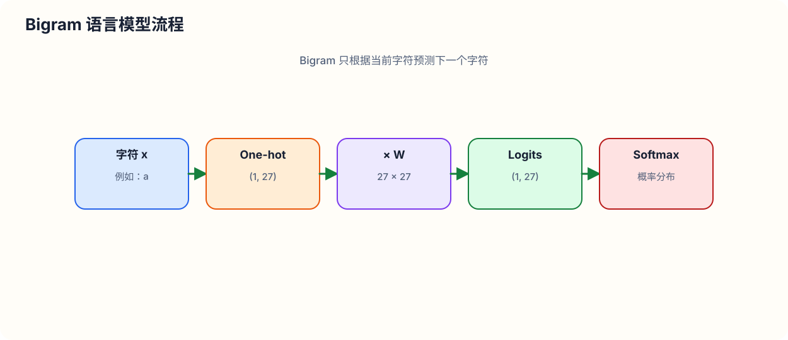

# Building makemore Part 1: Bigram 语言模型 (Bigram Language Model)

> **课程简介**：本教程基于 Andrej Karpathy 的《Building makemore》第一部分。在本课中，我们将从零开始构建一个字符级的 Bigram 语言模型。我们将对比两种截然不同但本质等价的方法：
> 1. **基于统计计数的方法 (Counting-based Approach)**：显式统计字符转移频次矩阵并归一化。
> 2. **基于神经网络的方法 (Neural Network Approach)**：使用单层线性网络结合 Softmax 激活函数，通过负对数似然 (NLL) 损失与梯度下降法优化权重矩阵。
> 
> 本文保留了 Karpathy 教授原汁原味的教学直觉，涵盖详细的数学推导、PyTorch 张量操作（尤其是广播机制 Broadcasting 的陷阱）、代码实现以及深入的逻辑等价性证明。

---

## 1. 项目简介与数据集引入 (Introduction to makemore & Dataset)

### 1.1 什么是 makemore？

`makemore` 是 Andrej Karpathy 开源的一个轻量级字符级语言模型库。顾名思义，它的核心功能是**"生成更多 (makes more)"**你输入给它的数据。

例如，如果我们向 `makemore` 提供一个包含数万个英文名字的数据集 `names.txt`，模型就能自动学习这些名字在字符层面的统计规律与结构，进而自主生成一系列**听起来像名字、但实际上独一无二的新英文名字**（如 `zendy`、`tanzill` 等）。

`makemore` 的发展路线代表了字符级语言模型的演进过程：
* **Bigram 模型（本节课）**：仅根据前 1 个字符预测下一个字符。
* **Bag of Words / 词袋模型**
* **MLP（多层感知机）**：基于 Bengio 等人在 2003 年提出的经典语言模型架构。
* **RNN / LSTM**：循环神经网络。
* **CNN / WaveNet**：一维卷积语言模型。
* **Transformer**：现代 GPT 架构（如 GPT-2 级别的字符级 Transformer）。

在本系列课程中，我们将从一个完全空白的 Jupyter Notebook 开始，一行代码一行代码地搭建出所有这些模型。

### 1.2 数据集探索与预处理

我们首先加载数据集 `names.txt`。该数据集包含大约 32,000 个从政府网站随机收集的名字。

```python
# 读取数据并按行分割成单词列表
words = open('names.txt', 'r').read().splitlines()

# 查看前 10 个名字
print(words[:10])
# ['emma', 'olivia', 'ava', 'isabella', 'sophia', 'charlotte', 'mia', 'amelia', 'harper', 'evelyn']

# 数据集基本统计
print(f"名字总数: {len(words)}")  # 约 32033
print(f"最短名字长度: {min(len(w) for w in words)}")  # 2
print(f"最长名字长度: {max(len(w) for w in words)}")  # 15
```

每一个单词（如 `isabella`）在统计学上都包含了多条训练样本：
1. 字符 `i` 是名字开头的概率很高；
2. 在 `i` 之后，接字符 `s` 的概率；
3. 在 `is` 之后，接字符 `a` 的概率；
4. ...
5. 在最后一个字符 `a` 之后，**名字结束**的概率。

必须特别注意：**名字的结束也是一条极其关键的统计信号**，模型必须学会何时停止生成。

---

## 2. 传统统计方法：构建 Bigram 计数模型 (Counting-based Bigram Model)

### 2.1 什么是 Bigram 模型？

**Bigram（二元语法）模型**是一种极简的语言模型。它的基本假设是：**预测当前字符 $x_t$ 的概率，仅取决于紧邻它的前一个字符 $x_{t-1}$**。即：

$$P(x_t \mid x_1, x_2, \dots, x_{t-1}) \approx P(x_t \mid x_{t-1})$$

这是一个非常弱的模型，因为忽略了更早的上下文历史，但它是理解语言模型最佳的起点。

### 2.2 提取 Bigram 二元组

在 Python 中，提取连续字符对有一个非常优雅的写法：使用 `zip(w, w[1:])`。

为了表示单词的**开始**与**结束**，我们需要引入特殊的标记 (Special Tokens)：
* 起始标记：`<START>`
* 结束标记：`<END>`

为方便后续可视化与处理，我们可以将这两个特殊标记合并为一个单独的字符点号 `.`。

```python
# 构建 Bigram 频次字典
b = {}
for w in words:
    # 在单词首尾加上 '.' 标记
    chs = ['.'] + list(w) + ['.']
    for ch1, ch2 in zip(chs, chs[1:]):
        bigram = (ch1, ch2)
        b[bigram] = b.get(bigram, 0) + 1

# 按频次排序查看最高频与最低频的 Bigram
sorted_b = sorted(b.items(), key=lambda kv: kv[1], reverse=True)

# 频次最高的一些 Bigram（例如：'n.' 表示以 n 结尾，'a.' 表示以 a 结尾，'an' 等）
print("最高频 Bigrams:", sorted_b[:5])
# [('n', '.'), 6763], [('a', '.'), 6640], [('s', '.'), 3470], ...

# 频次最低的一些 Bigram（例如：'q', 'r' 等极罕见组合）
print("最低频 Bigrams:", sorted_b[-5:])
```

### 2.3 使用 PyTorch 构建 2D 频次矩阵 $N$

字典虽然方便，但无法利用 GPU 进行高效的平行矩阵运算。在现代深度学习中，我们通常将数据存储为二维张量 (2D Tensor)。

数据集中包含 26 个英文字母（`a` 到 `z`）加上 1 个特殊字符 `.`，总共有 27 个独立 Token。因此，频次矩阵 $N$ 的维度为 $27 \times 27$。

* 矩阵的**行 (Row)**：代表前一个字符 $x_1$。
* 矩阵的**列 (Column)**：代表后一个字符 $x_2$。
* 元素 $N_{i,j}$：表示在训练集中字符 $i$ 紧接着字符 $j$ 出现的总次数。

```python
import torch

# 提取字符集并建立双向映射表
chars = sorted(list(set(''.join(words))))
s2i = {s: i+1 for i, s in enumerate(chars)}
s2i['.'] = 0  # 将 '.' 映射为索引 0

i2s = {i: s for s, i in s2i.items()}

# 初始化 27x27 的频次张量 N，数据类型为 32 位整数
N = torch.zeros((27, 27), dtype=torch.int32)

# 填充频次矩阵
for w in words:
    chs = ['.'] + list(w) + ['.']
    for ch1, ch2 in zip(chs, chs[1:]):
        ix1 = s2i[ch1]
        ix2 = s2i[ch2]
        N[ix1, ix2] += 1
```

### 2.4 可视化频次矩阵 $N$

使用 `matplotlib`，我们可以绘制出这 $27 \times 27$ 的频次矩阵，清晰直观地观察字符转移规律：

```python
import matplotlib.pyplot as plt

plt.figure(figsize=(16, 16))
plt.imshow(N, cmap='Blues')
for i in range(27):
    for j in range(27):
        chstr = i2s[i] + i2s[j]
        plt.text(j, i, chstr, ha="center", va="bottom", color='gray')
        plt.text(j, i, N[i, j].item(), ha="center", va="top", color='gray')
plt.axis('off')
plt.show()
```

从中我们可以观察到：
* 第 0 行代表以 `.` 开头的 Bigram，展示了名字首字母的分布（如 `j`、`a` 开头的名字非常多）。
* 第 0 列代表以 `.` 结尾的 Bigram，展示了名字结尾字母的分布（如 `a`、`n` 结尾的名字极多）。

---

## 3. 从 Bigram 模型中采样 (Sampling from the Model)

有了频次矩阵 $N$ 后，我们需要将其转化为**条件概率分布 (Conditional Probability Distribution)** $P(x_2 \mid x_1)$，进而使用随机采样生成全新的名字。

### 3.1 归一化为概率分布

对于给定字符 $x_1$（即第 $i$ 行），下一个字符 $x_2$ 属于第 $j$ 个字符的概率为：

$$P(x_2 = j \mid x_1 = i) = \frac{N_{i,j}}{\sum_{k=0}^{26} N_{i,k}}$$

针对单个字符（例如从起点 `.` 开始，即第 0 行）：

```python
p = N[0].float()
p = p / p.sum()
# p 是一个维度为 (27,) 的一维概率向量，且 sum(p) == 1.0
```

### 3.2 使用 `torch.multinomial` 采样

`torch.multinomial` 可以根据传入的概率分布生成对应索引的随机采样值。

为了保证结果的可重复性，我们引入 `torch.Generator` 设置固定随机种子：

```python
g = torch.Generator().manual_seed(2147483647)

# 完整生成名字的采样循环
for i in range(20):
    out = []
    ix = 0  # 从起始符 '.' 开始
    while True:
        p = N[ix].float()
        p = p / p.sum()
        
        # 根据概率分布 p 采样下一个字符的索引
        ix = torch.multinomial(p, num_samples=1, replacement=True, generator=g).item()
        
        if ix == 0:  # 遇到了结束符 '.'
            break
        out.append(i2s[ix])
    
    print(''.join(out))
```

采样生成的名字如：`mor`、`akanqi`、`ana` 等。

虽然这些名字听起来具备一定的语言规律（比纯随机字符更好），但总体质量仍然非常低下。**原因在于 Bigram 模型只向前看 1 个字符**——模型知道 `m` 后面接 `o` 很常见，但它在生成 `r` 时已经完全忘记了开头是 `m`。

### 3.3 与均匀分布 (Uniform Distribution) 对比

如果模型完全未经过训练（即每个字符出现的概率均为均等的 $\frac{1}{27}$），生成的采样文本将是纯粹的无意义胡乱组合。对比实验证明，Bigram 计数矩阵确实从数据中提取到了有效的统计信息。

---

## 4. 张量操作与广播机制深度剖析 (Tensor Operations & Broadcasting)

在上一节中，我们在采样循环内部对每一行显式进行 `.float()` 和 `/ sum()` 运算。这在每次迭代时重复计算，效率极其低下。

正确的工程实践是：**预先一次性对整个 $27 \times 27$ 矩阵进行按行归一化**，得到概率矩阵 $P$。

### 4.1 矩阵归一化与 `torch.sum`

在 PyTorch 中，我们可以沿指定维度求和：

```python
P = N.float()
# 对维度 1 (列) 求和，即沿水平方向求每一行的总和
# keepdim=True 保证输出形状为 (27, 1)，而不是被压缩成 (27,)
P_sum = P.sum(dim=1, keepdim=True)

# 广播机制生效：(27, 27) / (27, 1) -> (27, 27)
P /= P_sum  # 或在内存中原地操作: P.div_(P_sum)
```

这里涉及深度学习中最核心且极易出错的技术细节：**PyTorch 广播机制 (Broadcasting Semantics)**。

### 4.2 广播规则 (Broadcasting Rules)

当两个张量进行二元运算符操作（如加减乘除）时，PyTorch 会尝试自动调整它们的形状。可广播的**充要条件**是：
1. 每个张量至少有一个维度。
2. 从**最右边（Trailing Dimension）**开始向前遍历维度尺寸时：
   * 两个维度的尺寸相等；或
   * 其中一个维度的尺寸为 $1$；或
   * 其中一个维度的尺寸不存在（已到达最左侧）。

#### 形状对齐分析：

假设我们希望将矩阵 $P$（形状 $(27, 27)$）除以行和向量：

* **正确做法 (`keepdim=True`)**：
  $$\begin{aligned}
  \text{P.shape} &= (27, 27) \\
  \text{P\_sum.shape} &= (27, 1)
  \end{aligned}$$
  * 从右向左：第 2 维一个是 $27$ 一个是 $1$（满足条件：其中一个是 1）；第 1 维都是 $27$（相等）。
  * 广播行为：把 $(27, 1)$ 的列向量在水平方向**复制 27 次**扩展为 $(27, 27)$，然后进行**逐元素除法 (Element-wise Division)**。这正是我们想要的**按行归一化**！

* **经典致命 Bug (`keepdim=False`)**：
  如果设置 `keepdim=False`，`P.sum(dim=1)` 输出的形状将是 $(27,)$。
  $$\begin{aligned}
  \text{P.shape} &= (27, 27) \\
  \text{P\_sum.shape} &= (27,) \implies \text{隐式补 1 变为 } (1, 27)
  \end{aligned}$$
  * 根据广播规则第 1 条（右对齐），PyTorch 会在左侧隐式补充一个维度，使其变为 $(1, 27)$。
  * 广播行为：把 $(1, 27)$ 的行向量在垂直方向**复制 27 次**扩展为 $(27, 27)$。
  * 结果：我们原本想按行归一化，最终却错误地变成了**按列归一化**！此时每行的概率和并不为 1，代码不会抛出任何 Exception，但整个模型的结果完全被毁掉。

> [!CAUTION]
> **警示**：在 PyTorch 中使用 `torch.sum`、`torch.mean` 等聚合函数配合除法/减法时，必须严格检查 `keepdim` 参数！广播机制的静默维度补齐（Silent Dimension Expansion）是导致严重算法 Bug 的最大隐患之一。

---

## 5. 模型的评估指标：负对数似然损失 (Evaluating Model Quality: Negative Log Likelihood)

有了模型 $P$ 之后，我们如何用一个**单一的数值**来定量评价这个模型的质量优劣？

### 5.1 似然 (Likelihood) 与对数似然 (Log Likelihood)

假设数据集由 $N$ 个 Bigram 样本构成 $(x_1^{(i)}, x_2^{(i)})$。模型为整个数据集分配的总体概率，称为**似然 (Likelihood)**。如果模型很好，它赋予数据集中实际出现的字符对的概率应该尽可能接近 1：

$$\text{Likelihood} = \prod_{i=1}^{N} P(x_2^{(i)} \mid x_1^{(i)})$$

由于每个概率 $P \in [0, 1]$，成千上万个概率值相乘会导致严重的**算术下溢 (Arithmetic Underflow)**（结果极度接近于 0）。

为了解决下溢问题，数学上通常取对数，将**连乘化为连加**，即**对数似然 (Log Likelihood, LL)**：

$$\text{LL} = \ln(\text{Likelihood}) = \sum_{i=1}^{N} \ln P(x_2^{(i)} \mid x_1^{(i)})$$

* 因为 $P \in (0, 1]$，所以 $\ln(P) \in (-\infty, 0]$。
* 若模型预测完全准确（所有概率为 1），则 $\text{LL} = 0$；模型预测越差，$\text{LL}$ 越趋近于 $-\infty$。

### 5.2 负对数似然 (Negative Log Likelihood, NLL) 损失

在深度学习与优化理论中，习惯将优化目标设定为**最小化损失函数 (Loss Function)**（即越小越好）。

为此，我们将对数似然取负号，并对样本数求平均，得到**平均负对数似然损失 (Average NLL Loss)**：

$$\text{Loss} = -\frac{1}{N} \sum_{i=1}^{N} \ln P(x_2^{(i)} \mid x_1^{(i)})$$

* 目标：**最大化似然 $\iff$ 最大化对数似然 $\iff$ 最小化负对数似然损失**。
* 当所有预测概率为 1 时，$\text{Loss} = 0.0$。损失值越低，模型品质越高。

```python
log_likelihood = 0.0
n = 0

for w in words:
    chs = ['.'] + list(w) + ['.']
    for ch1, ch2 in zip(chs, chs[1:]):
        ix1 = s2i[ch1]
        ix2 = s2i[ch2]
        prob = P[ix1, ix2]
        logprob = torch.log(prob)
        log_likelihood += logprob
        n += 1

nll = -log_likelihood
loss = nll / n
print(f"平均负对数似然损失: {loss.item():.4f}")  # 约 2.4544
```

在整个 `names.txt` 数据集上，我们的 Counting Bigram 模型的平均 NLL 损失为 **2.4544**。

### 5.3 模型平滑 (Model Smoothing / Label Smoothing)

假设我们在测试集中遇到了一个特定的字符组合（例如 `j` 后面接 `q`，即 `jq`），而这个二元组在训练集中出现的次数为 0 ($N_{\text{j, q}} = 0$)。

那么模型分配给它的概率将为 0：$P(\text{q} \mid \text{j}) = 0.0$。
在计算损失时：$\ln(0.0) = -\infty \implies \text{Loss} = +\infty$！

仅仅因为一个未见过的字符组合，整个模型的损失就变成了无穷大，这在实际工程中是不可接受的。

**解决方案**：给频次矩阵加上平滑常数（如 $+1$ 或 $+c$），称为**模型平滑 (Model Smoothing)**：

$$P(x_2 = j \mid x_1 = i) = \frac{N_{i,j} + 1}{\sum_{k} (N_{i,k} + 1)}$$

增加假频次 $+1$ 可以确保没有任何一个概率为 0，防止发生无穷大损失。在增加 $+1$ 平滑后，总体损失略微上升至 **2.4764**。

---

## 6. 神经网络视角下的 Bigram 模型 (Neural Network Framework for Bigram)

到目前为止，我们是通过显式计数和矩阵归一化直接得到了 Bigram 模型。

现在，我们将进行一次思想上的重大飞跃：**如何将 Bigram 语言模型重构为一个神经网络问题？**

### 6.1 神经网络架构设计

我们将设计一个极简的神经网络：
1. **输入**：单个字符 $x$（例如前一个字符）。
2. **神经网络**：包含权重矩阵 $W$，对输入做线性映射。
3. **输出**：一个包含 27 个元素的概率分布向量，预测下一个字符 $y$ 的概率。
4. **损失函数**：负对数似然 (NLL) 损失。
5. **优化**：通过反向传播计算梯度 $\nabla_W \text{Loss}$，更新 $W$ 以最小化损失。



### 6.2 构建训练集张量 $X$ 与 $Y$

首先，将文本分割出的二元组转换为神经网络输入张量 $X$ 与目标标签张量 $Y$：

```python
xs, ys = [], []

for w in words[:1]:  # 先以单词 'emma' 为例
    chs = ['.'] + list(w) + ['.']
    for ch1, ch2 in zip(chs, chs[1:]):
        xs.append(s2i[ch1])
        ys.append(s2i[ch2])

xs = torch.tensor(xs)  # tensor([0, 5, 13, 13, 1])
ys = torch.tensor(ys)  # tensor([5, 13, 13, 1, 0])
```

> [!NOTE]
> **API 陷阱警示**：PyTorch 中存在 `torch.tensor`（小写 t）与 `torch.Tensor`（大写 T）。
> * `torch.tensor`：根据输入自动推导数据类型（对于整数列表会自动输出 `int64`）。
> * `torch.Tensor`：默认构建 `float32` 张量。
> 在构建离散索引时，推荐明确使用小写的 `torch.tensor(..., dtype=torch.long)`。

### 6.3 字符的 One-hot 编码 (One-Hot Encoding)

离散的字符索引整数（如 `5` 或 `13`）不能直接乘上权重矩阵 $W$，因为整数值的大小（如 13 比 5 大）并不代表任何物理意义。

神经网络标准的输入方式是 **One-hot 编码**：将整数 $k$ 转为维度为 27 的向量，其中只有第 $k$ 个位置为 1.0，其余位置均为 0.0。

```python
import torch.nn.functional as F

# 将形状为 (N,) 的整数张量编码为 (N, 27) 的 float32 张量
xenc = F.one_hot(xs, num_classes=27).float()
print(xenc.shape)  # torch.Size([5, 27])
```

### 6.4 前向传播：线性层 + Softmax

#### 1. 线性层与 Logits

定义权重矩阵 $W \in \mathbb{R}^{27 \times 27}$。矩阵乘法 $X_{\text{enc}} \cdot W$ 的计算如下：

$$\text{logits} = X_{\text{enc}} \cdot W \quad (\text{维度}: (N, 27) \times (27, 27) = (N, 27))$$

输出的 27 个数值被称为 **Logits（对数频次/未归一化对数概率）**。其物理含义等价于神经网络预测的“对数频次” $\ln(\text{counts})$。

#### 2. Softmax 激活函数

由于 Logits 包含正数和负数，无法直接作为概率。我们需要通过 **Softmax** 函数将其转化为合法的概率分布：

1. **指数化 (Exponentiation)**：求 $e^{z_i}$，将实数映射为正数 $\text{counts} = e^{\text{logits}} \in (0, +\infty)$。
2. **归一化 (Normalization)**：将每一行除以该行的和，得到概率分布 $P$。

数学公式：

$$\text{Softmax}(z_i) = \frac{e^{z_i}}{\sum_{j=1}^{K} e^{z_j}}$$

代码实现：

```python
# 1. 权重初始化（从标准正态分布抽样）
g = torch.Generator().manual_seed(2147483647)
W = torch.randn((27, 27), generator=g, requires_grad=True)

# 2. 前向传播
# 线性映射 -> logits
logits = xenc @ W  # @ 是 PyTorch 矩阵乘法的简写

# Softmax 操作
counts = logits.exp()  # 等价于计算 N 矩阵
probs = counts / counts.sum(1, keepdim=True)  # 按行归一化得到概率 P
```

整个过程均由可微（Differentiable）的数学基础算子构成，因此完全支持自动微分！

---

## 7. 基于梯度的优化与反向传播 (Gradient-based Optimization & Backpropagation)

### 7.1 计算 NLL 损失

在前向传播输出概率矩阵 `probs`（形状为 $(N, 27)$）后，我们需要提取出**对应真实目标标签 `ys` 的概率**：

```python
# 假设样本数 N=5, ys = tensor([5, 13, 13, 1, 0])
# 使用高级索引提取对应概率:
loss = -probs[torch.arange(len(ys)), ys].log().mean()
print(f"当前初始 Loss: {loss.item():.4f}")
```

### 7.2 完整训练循环 (Training Loop)

结合反向传播与梯度下降，我们可以写出标准的 PyTorch 训练循环：

```python
# 1. 准备全量训练数据
xs, ys = [], []
for w in words:
    chs = ['.'] + list(w) + ['.']
    for ch1, ch2 in zip(chs, chs[1:]):
        xs.append(s2i[ch1])
        ys.append(s2i[ch2])

xs = torch.tensor(xs)
ys = torch.tensor(ys)
num_samples = len(xs)
print(f"总训练二元组样本数: {num_samples}")  # 228146

# 2. 初始化网络权重 W
g = torch.Generator().manual_seed(2147483647)
W = torch.randn((27, 27), generator=g, requires_grad=True)

# 3. 梯度下降训练循环
learning_rate = 50.0  # 由于模型简单且没有任何复杂激活层，可以使用较大的学习率

for step in range(100):
    # === 前向传播 (Forward Pass) ===
    xenc = F.one_hot(xs, num_classes=27).float()
    logits = xenc @ W
    counts = logits.exp()
    probs = counts / counts.sum(1, keepdim=True)
    
    # 计算平均 NLL Loss
    loss = -probs[torch.arange(num_samples), ys].log().mean()
    
    # === 反向传播 (Backward Pass) ===
    W.grad = None  # 清空旧梯度（比 W.grad.zero_() 更高效）
    loss.backward()
    
    # === 参数更新 (Parameter Update) ===
    W.data += -learning_rate * W.grad
    
    if step % 10 == 0:
        print(f"Step {step:3d} | Loss: {loss.item():.4f}")
```

运行结果：经过 100 次梯度下降迭代后，Loss 稳步下降，最终精准地收敛到了 **2.45~2.47** 左右！

---

## 8. 两种方法的内在等价性与正则化视角 (Equivalence of Counting and Neural Net & Regularization)

### 8.1 查表 (Lookup Table) 与矩阵乘法的等价性

仔细分析神经网络的前向传播：`xenc @ W`。

`xenc` 是一个 One-hot 向量（例如第 $k$ 个元素为 1，其余为 0）。根据矩阵乘法规则，**一个 One-hot 向量乘以矩阵 $W$，其结果完全等价于直接提取矩阵 $W$ 的第 $k$ 行**！

$$\text{OneHot}(k) \cdot W = W[k, :]$$

因此：
* **权重矩阵 $W$ 的第 $i$ 行**，在物理含义上就代表字符 $i$ 后接各个字符的**未归一化对数频次 (Log-counts)**。
* $e^{W}$ 的值，就对应基于计数方法中的频次矩阵 $N$！

两种方法的最终对比：

| 特性 | 基于计数的 Bigram 模型 | 基于神经网络的 Bigram 模型 |
| :--- | :--- | :--- |
| **核心存储** | 显示统计频次矩阵 $N$ | 权重矩阵 $W$ （对数频次） |
| **概率计算** | $P = N / \text{sum}(N)$ | $P = \text{Softmax}(W)$ |
| **求解方式** | 计数法（闭式解） | 梯度下降迭代法 |
| **可扩展性** | **差**（无法处理更大上下文，维度灾难） | **极强**（可无缝扩充为 MLP、Transformer） |

### 8.2 标签平滑与 $L_2$ 权重正则化 (Weight Regularization) 的等价性

在基于计数的方法中，为了防止概率为 0，我们使用了平滑操作（给频次矩阵加上 $+1$）。

在神经网络视角下，这对应什么概念？

如果我们将权重矩阵 $W$ 中的所有元素都设为 0（$W = \mathbf{0}$）：
$$\text{logits} = \mathbf{0} \implies \text{counts} = e^{0} = 1.0 \implies \text{probs} = \frac{1}{27} \approx 0.037$$

此时，Softmax 的输出将是一个**完美的均匀分布 (Uniform Distribution)**。

因此，如果我们希望神经网络进行“平滑”，**本质上就是鼓励权重矩阵 $W$ 的元素接近于 0**。

我们可以在损失函数中显式添加一个 **$L_2$ 正则化项（权重衰减 Weight Decay）**：

$$\text{Loss}_{\text{total}} = \text{Loss}_{\text{NLL}} + \lambda \sum_{i,j} W_{i,j}^2$$

```python
# 带有 L2 正则化的 Loss 计算
regularization_loss = 0.01 * (W**2).mean()
total_loss = loss + regularization_loss
```

* 正则化项就像给权重 $W$ 施加了一个拉向 0 的**弹簧拉力/引力**。
* 超参数 $\lambda$ 控制正则化强度：$\lambda$ 越大，权重越趋近于 0，模型的输出概率越平滑、越均匀。
* **结论：计数模型中的模型平滑，完全等价于神经网络模型中的 $L_2$ 权重正则化！**

---

## 9. 从神经网络模型中采样与课程总结 (Sampling from Neural Net & Conclusion)

### 9.1 从训练好的神经网络采样

训练完成后，我们可以直接利用学习到的权重矩阵 $W$ 进行文本生成：

```python
g = torch.Generator().manual_seed(2147483647)

for i in range(5):
    out = []
    ix = 0
    while True:
        # 1. 将当前字符转为 One-hot 向量
        xenc = F.one_hot(torch.tensor([ix]), num_classes=27).float()
        
        # 2. 前向传播计算概率分布
        logits = xenc @ W
        counts = logits.exp()
        p = counts / counts.sum(1, keepdim=True)
        
        # 3. 采样下一个字符
        ix = torch.multinomial(p, num_samples=1, replacement=True, generator=g).item()
        
        if ix == 0:
            break
        out.append(i2s[ix])
        
    print(''.join(out))
```

采样生成的名字序列与基于频次统计模型生成的结果**完全一致**。这再次从代码和实践上验证了两种方法的完美统一。

---

### 9.2 总结与展望

在本节课中，我们深入学习了：
1. 字符级语言模型的基本概念与 Bigram 模型原理。
2. 如何使用 PyTorch 构建 2D 频次张量、概率归一化与采样。
3. PyTorch 广播机制 (Broadcasting) 的内在原理与 `keepdim` 坑点。
4. 负对数似然损失 (NLL Loss) 的推导与物理意义。
5. 神经网络框架下的单层模型构建、Softmax 激活函数、反向传播与梯度下降。
6. Counting 模型与 Neural Network 模型在本质上的数学等价性，以及平滑与 $L_2$ 正则化的关系。

**为什么基于神经网络的方法更好？**
尽管在 Bigram 这种超简单场景下，计数法可以瞬间算出结果，但当我们需要将上下文长度从 1 扩充到 10、100 甚至 1024 个字符时，计数矩阵的维度将发生指数级爆炸（$27^{10}$ 维），导致存储和计算完全不可行。

而神经网络方法可以通过将输入映射到连续嵌入空间（Embeddings），利用多层感知机（MLP）、循环神经网络（RNN）或 Transformer 架构，以极高的效率处理长上下文输入。

在下一节课中，我们将把模型重构为 Bengio 2003 论文中的 **MLP（多层感知机）架构**，开启迈向现代大语言模型 (LLM) 的下一阶段！
