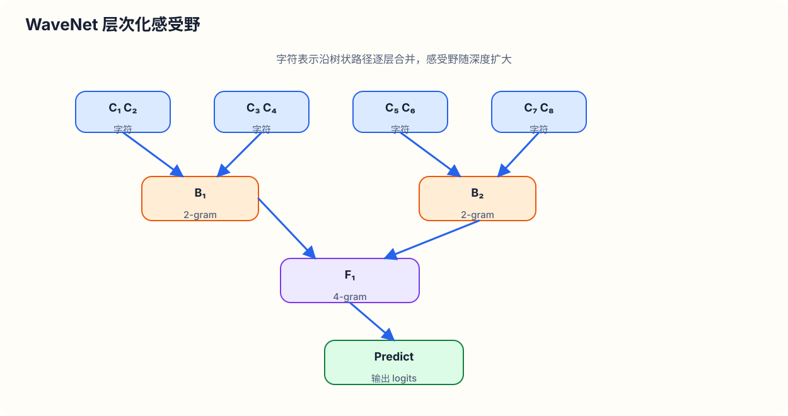
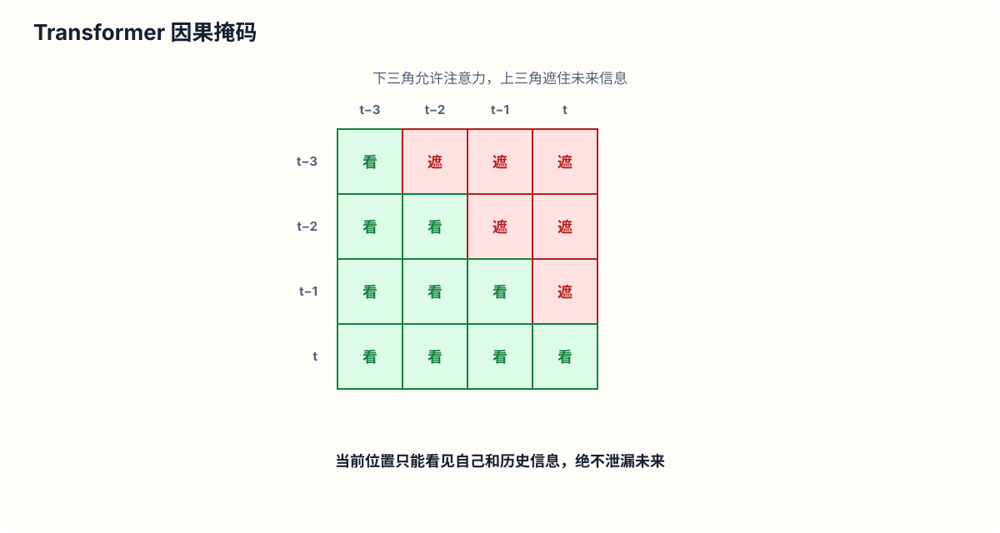
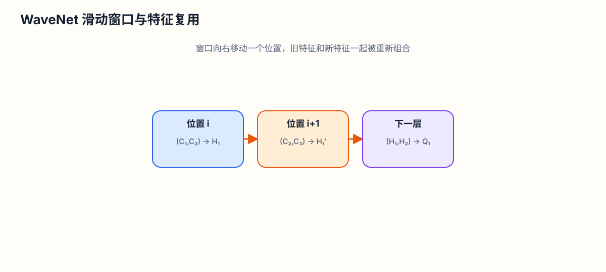

# MakeMore 第 5 部分：构建 WaveNet 层次化神经网络结构与 3D BatchNorm Bug 深度排查

本课程是 Andrej Karpathy《神经网络：从零开始构建 MakeMore》系列的第 5 部分。在前面的课程中，我们从简单的 Multilayer Perceptron (MLP) 字符级语言模型出发，构建了基于固定上下文预测下一个字符的模型。

本节课的核心目标是**重构并升级**这一网络架构：
1. **扩展上下文长度**：将输入上下文长度从 $3$ 个字符扩展到 $8$ 个字符。
2. **层次化树状融合**：解决单隐层 MLP 在第一层就将所有输入信息“过早压缩” (squashing information too quickly) 的问题，改为逐步融合并提炼信息。
3. **对标 WaveNet 架构**：实现类似于 DeepMind 2016 年提出的 **WaveNet** 论文中的层次化树状信息融合结构（Hierarchical Tree Fusion Structure）。
4. **PyTorch 容器化与模块化重构**：手写 PyTorch 风格的 `Sequential` 容器、`Embedding` 层以及 `FlattenConsecutive` 模块。
5. **深度排查并修复 3D BatchNorm1d Bug**：详细分析高维张量在批归一化（Batch Normalization）层中发生的统计量计算错误并予以修复。

---

## 1. 代码重构与 PyTorch 模块化 (Refactoring & PyTorchifying Code)

### 1.1 可视化损失曲线平滑化

在之前的训练循环中，我们将每个 step 的损失值 `loss.item()` 保存在列表 `lossi` 中。然而，当批次大小 (Batch Size) 较小（如 $B=32$）时，随机批次的采样的波动极大，直接绘制 `lossi` 会导致损失曲线充斥大量的极高频噪声，无法清晰观察训练收敛趋势。

我们可以利用 PyTorch 张量的 `view()` 与 `mean()` 操作，对连续 $1000$ 个 step 的损失做均值平滑处理：

```python
import torch
import matplotlib.pyplot as plt

# 将长度为 N 的 float 列表转换为张量，并变形为 (N / 1000, 1000) 的二维矩阵
# 在第 1 维（每行 1000 个元素）上求均值，得到形状为 (N / 1000,) 的平滑损失列表
lossi_tensor = torch.tensor(lossi)
plt.plot(lossi_tensor.view(-1, 1000).mean(dim=1))
plt.xlabel("Iteration (x1000)")
plt.ylabel("Loss")
plt.show()
```

这种降采样平滑方法能够清晰显示学习率衰减（Learning Rate Decay）阶段系统能量骤降、模型陷入局部极小值的全过程。

---

### 1.2 自定义网络层模块 (Building Custom Block Modules)

为了使代码符合 PyTorch 标准 API 规范，我们将分散的前向传播逻辑封装为独立的层对象。

#### Embedding 模块
以前我们直接对全局矩阵 `C` 进行索引切片 `C[Xb]`。现在将其封装为 `Embedding` 类：

```python
class Embedding:
    def __init__(self, num_embeddings, embedding_dim):
        # 初始化可学习的权重矩阵，形状为 (num_embeddings, embedding_dim)
        self.weight = torch.randn((num_embeddings, embedding_dim))
    
    def __call__(self, IX):
        # 提取对应索引的嵌入向量，输入形状 (B, T)，输出形状 (B, T, C)
        self.out = self.weight[IX]
        return self.out
    
    def parameters(self):
        return [self.weight]
```

---

### 1.3 手写 `Sequential` 容器

在 PyTorch 标准库中，`torch.nn.Sequential` 用于将多个层顺序组合成一个完整的计算图。我们可以手写一个等价的 `Sequential` 容器类：

```python
class Sequential:
    def __init__(self, layers):
        self.layers = layers
    
    def __call__(self, x):
        # 前向传播：依次将上一个层的输出作为下一个层的输入
        for layer in self.layers:
            x = layer(x)
        self.out = x
        return self.out
    
    def parameters(self):
        # 收集所有子模块的可学习参数
        return [p for layer in self.layers for p in layer.parameters()]
```

借由 `Sequential`，我们的网络定义与前向传播简化为极其优雅的声明式代码：

```python
model = Sequential([
    Embedding(vocab_size, n_embd),
    FlattenConsecutive(block_size), # 初始为完全展平
    Linear(n_embd * block_size, n_hidden, bias=False),
    BatchNorm1d(n_hidden),
    Tanh(),
    Linear(n_hidden, vocab_size)
])

# 参数列表获取
parameters = model.parameters()

# 前向传播
logits = model(Xb)
loss = F.cross_entropy(logits, Yb)
```

---

## 2. BatchNorm 状态管理与推理采样 Bug (BatchNorm State & Evaluation Bug)

在评估模型或从模型中采样生成文本时，必须注意 `BatchNorm1d` 层的状态管理。

### 2.1 评估模式设置

由于 `BatchNorm1d` 在训练阶段与推理阶段的计算逻辑不同：
- **训练阶段**：利用当前 Batch 数据的均值和方差进行归一化，同时更新全局累积的 `running_mean` 与 `running_var`（指数移动平均）。
- **推理/评估阶段**：禁止使用当前 Batch 的统计量，必须固定使用已经训练好的 `running_mean` 与 `running_var`。

因此在评估之前，必须遍历所有模块将 `training` 标记设为 `False`：

```python
for layer in model.layers:
    layer.training = False
```

### 2.2 评估模式缺失导致的 NaN 致命错误

在推理时，如果我们只传入单条文本序列（如上下文样本，Batch Size $B=1$），且忘记切换到评估模式：
1. `BatchNorm1d` 会尝试计算当前 Batch 的样本方差。
2. 样本无偏方差公式为：
   $$\text{Var}(x) = \frac{1}{N-1} \sum_{i=1}^{N} (x_i - \mu)^2$$
3. 当样本量 $N = 1$ 时，分母 $N - 1 = 0$。这会导致除零错误，计算得出的方差变成 `NaN` (Not a Number)。
4. `NaN` 值将迅速污染整个神经网络后续的所有计算，导致前向传播输出完全崩溃。

---

## 3. WaveNet 树状层次化融合架构 (WaveNet & Progressive Fusion Architecture)

### 3.1 传统 MLP 的局限

在经典的字符级 MLP（如 Bengio 等人 2003 年的论文架构）中，假设上下文长度为 $T=8$，嵌入维度为 $C=10$：
- 输入张量形状为 $(B, 8, 10)$。
- 展平层将其直接压扁为 $(B, 80)$ 的一维向量。
- 第一层线性层直接将这 $80$ 个特征投射到隐藏层。

这种设计的缺陷在于：**它在网络的最第一层就将全部上下文字符信息强行挤压在了一起**。网络缺乏对上下文层次化结构（如相邻字符构成 Bigram，相邻 Bigram 构成短语等）的渐进式抽象能力。

### 3.2 WaveNet 层次化融合原理

DeepMind 的 **WaveNet** (2016) 论文提出了一种自回归生成模型。其核心思想是采用**树状层次化融合结构**（Progressive Tree Fusion）：



信息在网络深入的过程中被缓慢、逐层地提炼融合：
1. **第 1 层**：每相邻 $2$ 个字符融合为一个 Bigram 表示（由 $8$ 个节点减少为 $4$ 个节点）。
2. **第 2 层**：每相邻 $2$ 个 Bigram 融合为一个 $4$-gram 表示（由 $4$ 个节点减少为 $2$ 个节点）。
3. **第 3 层**：每相邻 $2$ 个 $4$-gram 融合为全局上下文表示（由 $2$ 个节点减少为 $1$ 个节点）。

---

### 3.3 高维张量线性变换法则 (High-Dimensional Matrix Multiplication Rules)

要在 PyTorch 中高效实现上述树状融合，关键在于理解高维张量的矩阵乘法运算规律。

在 PyTorch 中，`torch.matmul(x, weight)` 支持任意维度张量输入。当输入 $x$ 的维度超过 $2$ 维时：
$$\text{Shape}(x) = (D_1, D_2, \dots, D_{k}, C_{in})$$
$$\text{Shape}(W) = (C_{in}, C_{out})$$
$$\text{Shape}(\text{Output}) = (D_1, D_2, \dots, D_{k}, C_{out})$$

**原则**：矩阵乘法**仅在最后一个维度**（即特征维度 $C_{in} \to C_{out}$）上执行，前面的所有维度 $(D_1, D_2, \dots, D_k)$ 统统被视为**并行批次维度 (Batch Dimensions)**。

这一特性允许我们在不编写显式循环的情况下，将多个分组组合在同一层中并行计算！

---

## 4. `FlattenConsecutive` 模块实现与张量维度变换

为了配合层次化融合，我们需要修改传统的 `Flatten` 模块，使其能够指定只对相邻 $n$ 个连续元素做展平拼接。

### 4.1 手写 `FlattenConsecutive` 类

```python
class FlattenConsecutive:
    def __init__(self, n):
        self.n = n # 连续融合的元素数量（如 n=2）
        
    def __call__(self, x):
        # 假设输入 x 的形状为 (B, T, C)
        B, T, C = x.shape
        
        # 将 T 个时间步按每 n 个一组重新组织
        # 新形状为 (B, T // n, n * C)
        x = x.view(B, T // self.n, C * self.n)
        
        # 如果中间的时间步维度缩小为 1，则使用 squeeze 降维
        if x.shape[1] == 1:
            x = x.squeeze(1)
            
        self.out = x
        return self.out
    
    def parameters(self):
        return []
```

---

### 4.2 张量零拷贝 View 的数学与物理验证

有人可能会怀疑：直接使用 `x.view(B, T // 2, 2 * C)` 能否保证在最后一个维度上正确拼接了相邻的时间步 $[t_0, t_1], [t_2, t_3]$？

我们可以通过显式切片拼接（Explicit Slice Concatenation）与 `view()` 进行对比验证：

```python
# 假设输入 e 的形状为 (B=4, T=8, C=10)
# 方法 A：显式切片并沿着特征轴 (dim=2) 拼接偶数步与奇数步
e_even = e[:, ::2, :] # 形状 (4, 4, 10)，包含索引 0, 2, 4, 6
e_odd  = e[:, 1::2, :] # 形状 (4, 4, 10)，包含索引 1, 3, 5, 7
explicit_cat = torch.cat([e_even, e_odd], dim=2) # 形状 (4, 4, 20)

# 方法 B：直接 view
implicit_view = e.view(4, 4, 20)

# 验证数值完全相等
print((explicit_cat == implicit_view).all().item()) # 输出: True
```

由于 PyTorch 张量在底层 C 语言内存中是以行优先（Row-Major）的连续数组存储的，时间维度 $T$ 与特征维度 $C$ 在内存地址上是紧密相邻的。因此，简单地重塑形状 `view(B, T // 2, 2 * C)` 在物理存储上天然就是将时间步 $t_{2k}$ 和 $t_{2k+1}$ 的特征向量平铺拼接在一起。该操作开销为 $O(1)$，无需复制任何内存！

---

## 5. 深度排查并修复 3D BatchNorm1d Bug

在将 `FlattenConsecutive(2)` 引入网络后，每一层的张量变成了 3D 结构（例如形状为 $(B=32, T=4, C=68)$）。虽然代码能够运行不报错，但模型训练效果却不及预期。这里隐藏着一个极具隐蔽性的 **3D Tensor BatchNorm Bug**。

### 5.1 Bug 根源分析

回顾我们此前实现的 `BatchNorm1d` 前向传播代码：

```python
# 旧版本 BatchNorm1d 的均值计算
xmean = x.mean(0, keepdim=True) # 仅对第 0 维 (Batch 维度) 求均值
xvar  = x.var(0, keepdim=True)  # 仅对第 0 维 (Batch 维度) 求方差
```

当输入 $x$ 为 2D 张量 $(B, C)$ 时：
- `x.mean(0)` 跨越 $B$ 个样本计算均值，输出形状为 $(1, C)$，完全正确。

当输入 $x$ 变为 3D 张量 $(B=32, T=4, C=68)$ 时：
- `x.mean(0)` **仅沿着第 0 维求均值**，计算结果的形状为 $(1, 4, 68)$！
- 这意味着：`running_mean` 和 `running_var` 的形状也变成了 $(1, 4, 68)$。
- **严重逻辑错误**：`BatchNorm1d` 错误地为序列中的 $4$ 个不同位置分别独立维护了 $4$ 套不同的均值和方差统计量！而真正的通道数只有 $C=68$ 个。
- 我们原本希望将 $B$ 维度和 $T$ 维度**同时**作为 Batch 归一化的统计样本（即样本总量应为 $B \times T = 32 \times 4 = 128$），但原代码只在 $32$ 个样本上做归一化。

---

### 5.2 数学原理与代码修复

为了使 3D 张量能够正确地跨越 Batch 维度与 Time 维度求均值，均值与方差的数学公式应当为：

$$\mu_c = \frac{1}{B \cdot T} \sum_{i=1}^{B} \sum_{j=1}^{T} x_{i, j, c}$$

$$\sigma_c^2 = \frac{1}{B \cdot T} \sum_{i=1}^{B} \sum_{j=1}^{T} (x_{i, j, c} - \mu_c)^2$$

在 PyTorch 的 `torch.mean` 中，指定归纳维度 `dim` 参数不仅支持单个整数，还支持传入整数元组（Tuple of Ints）。

因此，我们应当根据输入张量的维数 `ndim` 动态选择归纳维度：

```python
class BatchNorm1d:
    def __init__(self, dim, eps=1e-5, momentum=0.1):
        self.eps = eps
        self.momentum = momentum
        self.training = True
        # 可学习参数
        self.gamma = torch.ones(dim)
        self.beta  = torch.zeros(dim)
        # 运行统计量
        self.running_mean = torch.zeros(dim)
        self.running_var  = torch.ones(dim)

    def __call__(self, x):
        # 动态推导计算均值和方差的维度
        if x.ndim == 2:
            dim = 0
        elif x.ndim == 3:
            dim = (0, 1) # 同时跨越 Batch 维度 (0) 和 Sequence 维度 (1)
        else:
            raise ValueError(f"Unsupported input ndim: {x.ndim}")

        if self.training:
            # 沿着指定维度计算批次均值与无偏方差
            xmean = x.mean(dim, keepdim=True)
            xvar  = x.var(dim, keepdim=True, unbiased=True)
            
            # 更新全局运行统计量（指数移动平均）
            with torch.no_grad():
                self.running_mean = (1 - self.momentum) * self.running_mean + self.momentum * xmean.squeeze()
                self.running_var  = (1 - self.momentum) * self.running_var  + self.momentum * xvar.squeeze()
        else:
            xmean = self.running_mean
            xvar  = self.running_var

        # 广播归一化并进行缩放平移
        xhat = (x - xmean) / torch.sqrt(xvar + self.eps)
        self.out = self.gamma * xhat + self.beta
        return self.out

    def parameters(self):
        return [self.gamma, self.beta]
```

修复之后：
- 无论输入是 2D $(B, C)$ 还是 3D $(B, T, C)$，`running_mean` 的形状永远保持为 $(C,)$（例如 $68$ 个通道对应 $68$ 个均值）。
- 用于估计统计量的样本总数从原本的 $B=32$ 提升到了 $B \times T = 128$，统计估计更加精准平稳，有效减轻了训练噪声。

---

### 5.3 与 PyTorch 官方 API 约定差异说明

> [!NOTE]
> **关于 PyTorch `torch.nn.BatchNorm1d` 的维度约定**：
> - **PyTorch 官方规范**：对于 3D 张量，官方期待的形状是 $(N, C, L)$，即通道维度 $C$ 处于中间第 1 维，序列长度 $L$ 在最后。因此 PyTorch 在内部对维度 `(0, 2)` 进行归纳求均值。
> - **我们的规范**：我们采用 NLP / Transformer 领域更普遍的 $(N, L, C)$ 约定，即通道维度 $C$ 在最后一个维度。因此我们对维度 `(0, 1)` 求均值。两种方式原理完全相同，仅为维度排列习惯差异。

---

## 6. 扩张因果卷积 (Dilated Causal Convolutions) 与 卷积网络前瞻

在 WaveNet 论文中，作者将其网络表述为“一堆堆叠的扩张因果卷积层（Stack of Dilated Causal Convolutional Layers）”。

### 6.1 卷积的本质：高效滑动滤波器

尽管“扩张因果卷积”听起来高深，但从计算逻辑来看，**它与我们刚才实现的层次化树状网络在数学表达上是完全等价的**。

- **显式 Python 循环**：假设我们要对文本 `D'Andre` 中的所有连续字符段应用网络，在 Python 中需要使用 `for` 循环遍历每个位置并多次调用前向传播。
- **卷积层 (Convolution Layer)**：卷积本质上就是将这个“在空间/时间轴上平移滑动的线性滤波器 (Sliding Linear Filter)”下沉到 CUDA 底层 Kernel 中并行化执行。



---

### 6.2 中间节点特征复用 (Feature Reuse)

在树状层次化结构中，相邻的滑动窗口之间存在大量的中间计算节点复用：



在使用卷积网络时，这些中间激活值在一次前向传播中被一次性计算并保存在显存中，后续层直接复用，从而极大地提升了模型的前向传播与反向传播效率。

---

## 7. 实验评估与模型演进对比 (Experimental Benchmarks)

我们在统一的数据集划分（训练集、验证集、测试集）上对不同架构的性能进行了量化对比：

| 模型架构 | 上下文长度 $T$ | 参数量 (Parameters) | 验证集损失 (Val Loss) | 架构说明与改进点 |
| :--- | :---: | :---: | :---: | :--- |
| **基础 MLP (Part 3)** | 3 | ~12,000 | **2.100** | 3 个字符直连单隐层 MLP |
| **扩展上下文 MLP** | 8 | ~22,000 | **2.027** | 仅仅将上下文扩充至 8 个字符 |
| **WaveNet 树状网络 (含 Bug)** | 8 | ~22,000 | **2.029** | 引入树状融合，但 3D BatchNorm 未正确归纳 $(0,1)$ 维 |
| **WaveNet 树状网络 (Bug 已修复)** | 8 | ~22,000 | **2.022** | 修复 3D BatchNorm，统计量估计更稳定 |
| **大容量 WaveNet 树状网络** | 8 | ~76,000 | **1.993** | 嵌入维度增至 $24$，隐藏层通道扩容，突破 2.0 关口 |

### 实验结论：
1. 单纯增大上下文长度 $T=3 \to 8$ 带来了最显著的性能提升 ($2.10 \to 2.027$)。
2. 在相同参数量约束下（~22k），层次化树状结构相比粗暴的展平 MLP 表现出更优的潜在建模能力，且更容易扩展到更深的网络层数。
3. 修复 3D BatchNorm Bug 后，模型收敛更加稳定，Validation Loss 得到了稳定改善。
4. 进一步增加通道容量（参数量提升至 ~76k）成功使 Validation Loss 突破 $2.0$ 大关，降至 **1.993**。

---

## 8. 深度学习工程开发流程与实践指南 (Engineering Lessons & Workflow)

在构建与调试深度神经网络时，建议遵循以下工程规范：

### 8.1 Jupyter Notebook 与标准代码库双轨并行
- **Jupyter Notebook**：极佳的原型试验场。适合用于测试单层张量维度变化、观察前向传播 Shape 是否对齐、快速绘制 Loss 曲线以及可视化调试。
- **VS Code / 代码库 (Repository)**：当网络结构在 Notebook 中验证无误后，将模块封装代码同步至 Python 模块文件，通过标准命令行脚本启动长时间的大规模训练与超参数搜索。

### 8.2 张量 Shape 审查 (Shapes Gymnastics)
在神经网络开发中，超过 80% 的 Bug 来源于张量维度的隐式变换错误。
- 习惯性地打印每一层输出的 `x.shape`。
- 对于高维张量变换（`view`, `permute`, `transpose`），必须在纸上或注释中明确标注维度含义（如 $(B, T, C)$）。

### 8.3 正确看待 PyTorch 官方文档
- PyTorch 官方文档虽然庞大，但在部分细节或特殊 Edge Cases 上可能缺乏清晰说明。
- 当对某个 API（如 `BatchNorm1d`, `conv1d`）在多维输入下的行为存在疑问时，不要迷信文档，手写最小化测试用例（Minimal Reproducible Example）验证其在不同 `ndim` 下的实际表现。

---

## 9. 课后挑战与未来展望 (Future Challenges)

### 9.1 课后思考与挑战
Karpathy 给出了一个开放性挑战：**尝试击败 1.993 的 Validation Loss！**

读者可以尝试以下探索方向：
1. **超参数搜索**：优化 Embedding 维度 $C$ 与 隐藏层通道 $H$ 的配比。
2. **容量对决**：在相同大参数量（如 ~76k）下，对比单隐层 MLP 与 深度 WaveNet 树状网络的性能上限。
3. **实现完整的 WaveNet 模块**：参考 WaveNet 论文原著，引入：
   - 门控激活单元（Gated Activation Units）：$\text{z} = \tanh(W_{f,k} * x) \odot \sigma(W_{g,k} * x)$
   - 残差连接（Residual Connections）与 跳跃连接（Skip Connections）。
4. **学习率调度与初始化**：结合 Kaiming 初始化与 Cosine 学习率衰减策略。

### 9.2 课程后续内容预告
在接下来的课程中，我们将继续深入探索更强大的序列建模架构：
- 卷积神经网络 (CNN) 及其在序列中的高效应用；
- 循环神经网络 (RNN, LSTM, GRU)；
- Transformer 架构与 Self-Attention 自注意力机制。
