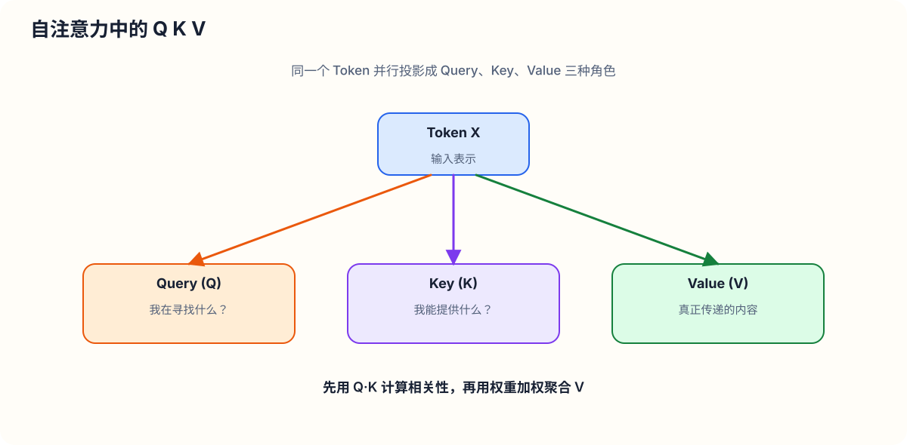
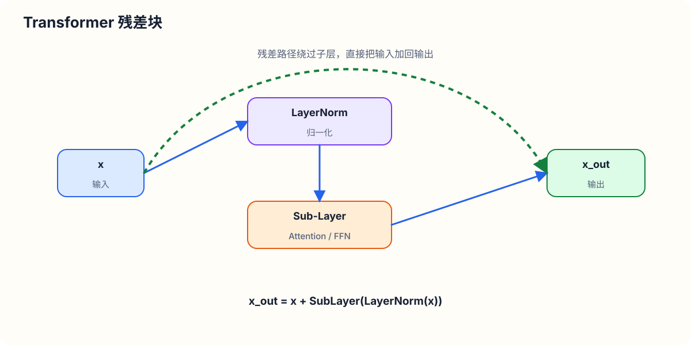
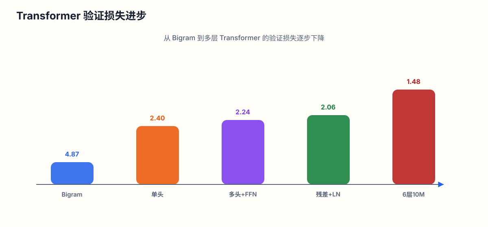
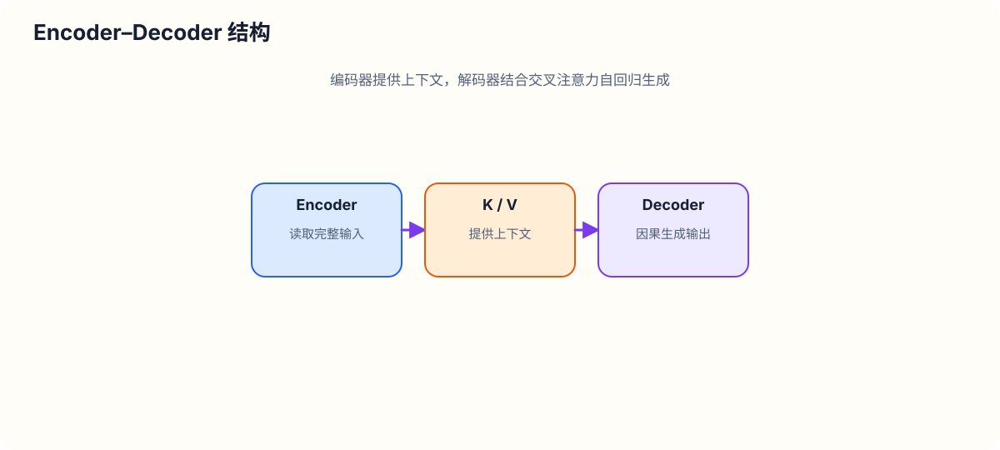
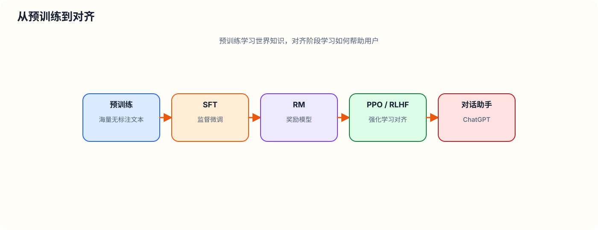

# 从头构建 NanoGPT：完整 Transformer 与 ChatGPT 原理解析

> **讲师**：Andrej Karpathy  
> **课程模块**：Neural Networks: Zero to Hero (从零构建神经网络)  
> **中文翻译与技术整理**：AI & Deep Learning Translation Specialist

---

## 目录

1. [引言与背景：ChatGPT 与 Transformer 架构](#1-引言与背景chatgpt-与-transformer-架构)
2. [数据预处理与 Tokenizer（分词器）](#2-数据预处理与-tokenizer分词器)
3. [数据批处理与上下文窗口（Batching & Block Size）](#3-数据批处理与上下文窗口batching--block-size)
4. [基础基线模型：Bigram 语言模型](#4-基础基线模型bigram-语言模型)
5. [Token 间通信的核心数学技巧：矩阵乘法与加权平均](#5-token-间通信的核心数学技巧矩阵乘法与加权平均)
6. [自注意力机制（Self-Attention）详解](#6-自注意力机制self-attention-详解)
7. [Transformer 核心组件构建](#7-transformer-核心组件构建)
   - [7.1 位置编码（Positional Embedding）](#71-位置编码positional-embedding)
   - [7.2 多头注意力机制（Multi-Head Attention）](#72-多头注意力机制multi-head-attention)
   - [7.3 前馈神经网络（Feed-Forward Network / MLP）](#73-前馈神经网络feed-forward-network--mlp)
   - [7.4 残差连接（Residual Connections）](#74-残差连接residual-connections)
   - [7.5 层归一化（Layer Normalization）](#75-层归一化layer-normalization)
   - [7.6 Dropout 正则化](#76-dropout-正则化)
8. [nanoGPT 架构整合与训练实战](#8-nanogpt-架构整合与训练实战)
9. [Transformer 经典架构辨析：Encoder-Decoder 与 Decoder-Only](#9-transformer-经典架构辨析encoder-decoder-与-decoder-only)
10. [从 nanoGPT 到 ChatGPT 的演进之路](#10-从-nanogpt-到-chatgpt-的演进之路)
11. [总结与展望](#11-总结与展望)

---

## 1. 引言与背景：ChatGPT 与 Transformer 架构

近年来，ChatGPT 掀起了一场人工智能的革命。作为一个人机交互系统，ChatGPT 能够理解人类的文本指令并完成各种复杂的文本任务（例如编写关于 AI 重要性的俳句、写一篇关于树叶落下的突发新闻报道等）。

### 1.1 语言模型的本质
从底层实现来看，ChatGPT 是一个**自回归语言模型（Autoregressive Language Model）**。所谓语言模型，是指对词语、字符或 Token（文本标记）序列的概率分布进行建模的系统。给定前文的上下文序列 $x_1, x_2, \dots, x_t$，语言模型的目标是预测下一个出现的 Token $x_{t+1}$ 的条件概率分布：

$$ P(x_{t+1} \mid x_1, x_2, \dots, x_t) $$

由于语言模型本质上是一个概率模型，在每次给定相同 Prompt（提示词）时，模型会根据概率采样生成稍有不同的续写文本。

### 1.2 Transformer 架构与 GPT
ChatGPT 底层驱动的核心神经网络源自 2017 年 Google 发表的一篇划时代的 AI 论文——**《Attention is All You Need》**。该论文首次提出了 **Transformer** 架构。

**GPT** 是 **Generative Pre-trained Transformer**（生成式预训练 Transformer）的缩写：
* **Generative（生成式）**：模型用于自回归地生成文本序列。
* **Pre-trained（预训练）**：模型首先在海量无标注文本数据上进行自监督预测学习。
* **Transformer（变换器）**：模型底层的神经网络架构。

最初 Transformer 被提出用于机器翻译任务，但随后几年内，该架构以惊人的速度席卷了整个 AI 领域（包括自然语言处理、计算机视觉、语音等），并成为了 ChatGPT 等大语言模型（LLM）的核心基石。

### 1.3 本课教学目标
本课程将带你**从零开始（From Scratch）** 手写一个名为 **nanoGPT** 的代码库：
1. 从一个空白文件开始，逐行实现 Transformer 的各个核心组件；
2. 在 **Tiny Shakespeare（莎士比亚小数据集）**（约 1MB 文本，包含约 100 万字符）上训练一个字符级（Character-level）Transformer 语言模型；
3. 最终实现从模型中生成无限量的莎士比亚风格戏剧文本；
4. 全面剖析从玩具级 nanoGPT 扩展到工业级 ChatGPT 的核心技术路径。

---

## 2. 数据预处理与 Tokenizer（分词器）

在将文本输入神经网络之前，首先需要将原始字符串转化为数字序列，这一过程称为**Tokenization（分词/标记化）**。

### 2.1 Tiny Shakespeare 数据集与词表构建
首先下载 Tiny Shakespeare 数据集并读取文本内容：该数据集包含约 1,000,000 个字符。

我们通过提取文本中所有出现的唯一字符并进行排序，构建模型的**词表（Vocabulary）**：

```python
with open('input.txt', 'r', encoding='utf-8') as f:
    text = f.read()

# 提取所有不重复的字符并排序
chars = sorted(list(set(text)))
vocab_size = len(chars)
print('Vocabulary size:', vocab_size)  # 输出: 65
```

在 Tiny Shakespeare 数据集中，共有 **65 个唯一字符**（包括换行符、空格、标点符号、大写和小写英文字母）。

### 2.2 字符级分词器（Character-level Tokenizer）
基于这 65 个字符，我们构建一个简单的字符级分词器，实现字符与整数 ID 之间的双向双射映射：

```python
# 创建字符到整数、整数到字符的映射查找表
stoi = { ch: i for i, ch in enumerate(chars) }
itos = { i: ch for i, ch in enumerate(chars) }

# 编码器：将字符串转换为整数列表
encode = lambda s: [stoi[c] for c in s]

# 解码器：将整数列表还原为字符串
decode = lambda l: ''.join([itos[i] for i in l])
```

例如，字符串 `"hi there"` 被 `encode` 后映射为整数列表 `[46, 47, 1, 58, 46, 43, 56, 43]`，经 `decode` 后可无损还原为原始字符串。

### 2.3 工业界 Tokenizer 方案对比
字符级 Tokenizer 的优点是逻辑极简、词表很小（$V = 65$），但缺点是文本转换后的序列长度较长。工业界大模型通常采用**子词级（Subword-level）分词器**：

| 分词器方案 | 代表应用 | 词表大小 $V$ | 特点与权衡 |
| :--- | :--- | :--- | :--- |
| **字符级 (Character-level)** | 本课 nanoGPT 基线 | ~65 | 词表极小，无需处理 OOV（词表外词），但序列长度非常长 |
| **SentencePiece** | Google LLaMA / T5 | 32,000 ~ 128,000 | 基于 Unigram / BPE 的子词切分，适合多语言 |
| **tiktoken (BPE)** | OpenAI GPT-2 / GPT-4 | 50,256 ~ 100,000+ | 基于字节对编码（Byte Pair Encoding），词表较大，序列更短 |

以 OpenAI 的 `tiktoken` 为例，字符串 `"hi there"` 只被切分为 2 个 Token ID，序列长度大幅缩短。**词表大小与序列长度存在直接的权衡（Trade-off）**：词表越大，单个 Token 代表的信息越丰富，序列越短，但模型词表 Embedding 矩阵越大。

### 2.4 数据集张量化与划分
将整个 100 万字符的文本编码为 PyTorch 的 `torch.Tensor` 长整型向量：

```python
import torch

data = torch.tensor(encode(text), dtype=torch.long)
n = int(0.9 * len(data))

# 划分为 90% 训练集，10% 验证集
train_data = data[:n]
val_data = data[n:]
```

---

## 3. 数据批处理与上下文窗口（Batching & Block Size）

在训练 Transformer 时，由于计算资源与内存限制，我们不可能一次性将整篇文本输入网络，而是对数据进行分块采样。

### 3.1 上下文长度（Block Size / Context Length）
我们定义 **`block_size`** $T$（例如 $T = 8$），表示模型预测下一个字符时所能看到的最大历史上下文长度。

如果抓取一段长度为 $T+1$（例如 9 个字符）的文本块，其中实际上**包含了 $T$ 个独立的训练样本**：

```python
block_size = 8
x = train_data[:block_size]
y = train_data[1:block_size+1]

for t in range(block_size):
    context = x[:t+1]
    target = y[t]
    print(f"当上下文为 {context} 时，期望预测的目标字符 ID 为: {target}")
```

这种打包预测设计具有两个极其重要的作用：
1. **计算效率**：单次前向传播同时训练 $T$ 个位置的预测；
2. **多尺度上下文适应**：模型能够学会从长度仅为 1 的上下文一直预测到长度为 $T$ 的最大上下文。这对于推理阶段至关重要，因为推理初始时模型可能仅有一个起始字符。

### 3.2 批次维度（Batch Dimension）
为了最大化利用 GPU 的并行计算能力，我们引入 **批大小（Batch Size）** $B$（例如 $B = 4$）。每次从数据集中随机采样 $B$ 个独立的文本块，并行拼接到一个二维张量中：

$$ X \in \mathbb{R}^{B \times T}, \quad Y \in \mathbb{R}^{B \times T} $$

其中 $X$ 是模型的输入特征，$Y$ 是对应的目标标签。

```python
torch.manual_seed(1337)
batch_size = 4   # 4 个独立并行序列
block_size = 8   # 上下文长度为 8

def get_batch(split):
    data_split = train_data if split == 'train' else val_data
    # 随机生成 batch_size 个起始索引
    ix = torch.randint(len(data_split) - block_size, (batch_size,))
    x = torch.stack([data_split[i:i+block_size] for i in ix])
    y = torch.stack([data_split[i+1:i+block_size+1] for i in ix])
    return x, y

xb, yb = get_batch('train')
# xb.shape = [4, 8], yb.shape = [4, 8]
```

对于形状为 $[4, 8]$ 的输入张量 $X$，总共包含了 $4 \times 8 = 32$ 个完全独立的上下文预测样本。

---

## 4. 基础基线模型：Bigram 语言模型

在引入复杂的 Transformer 架构前，我们先构建最简单的语言模型基线——**Bigram（二元语法）模型**。在 Bigram 模型中，预测下一个字符只取决于当前单个字符的身份，不参考更早的任何历史信息。

### 4.1 Bigram 模型的 PyTorch 实现

```python
import torch.nn as nn
from torch.nn import functional as F

class BigramLanguageModel(nn.Module):
    def __init__(self, vocab_size):
        super().__init__()
        # 每个 Token 直接从查找表中读取下一个 Token 的 Logits 分数
        self.token_embedding_table = nn.Embedding(vocab_size, vocab_size)

    def forward(self, idx, targets=None):
        # idx 和 targets 形状均为 (B, T)
        # logits 形状为 (B, T, C)，其中 C = vocab_size
        logits = self.token_embedding_table(idx)

        if targets is None:
            loss = None
        else:
            B, T, C = logits.shape
            # PyTorch 的 cross_entropy 期望输入的 Class 维度位于第二维
            # 需将 logits 重构为 (B*T, C)，targets 重构为 (B*T)
            logits = logits.view(B*T, C)
            targets = targets.view(B*T)
            loss = F.cross_entropy(logits, targets)

        return logits, loss
```

### 4.2 损失函数的理论推导与基准线
对于词表大小为 $V = 65$ 的随机未训练模型，如果概率分布完全均匀，预期理论交叉熵损失（负对数似然）应为：

$$ \mathcal{L}_{\text{theoretical}} = -\ln\left(\frac{1}{V}\right) = -\ln\left(\frac{1}{65}\right) \approx 4.1743 $$

实际上，若未经过特别初始化的概率分布带有一点随机熵，测得的初始损失约为 **4.87**。

### 4.3 文本自回归生成（Generation）

```python
    def generate(self, idx, max_new_tokens):
        # idx 形状为 (B, T)
        for _ in range(max_new_tokens):
            # 前向传播获得当前 logits
            logits, loss = self(idx)
            # 仅关注最后一个时间步 (t = -1) 的 logits
            logits = logits[:, -1, :] # 形状变为 (B, C)
            # 应用 Softmax 转化为概率分布
            probs = F.softmax(logits, dim=-1) # (B, C)
            # 从概率分布中采样下一个 Token
            idx_next = torch.multinomial(probs, num_samples=1) # (B, 1)
            # 将采样的 Token 拼接到现有序列末尾
            idx = torch.cat((idx, idx_next), dim=1) # (B, T+1)
        return idx
```

### 4.4 优化器训练与基线效果
使用 AdamW 优化器（学习率 $\alpha = 10^{-3}$）对 Bigram 模型进行训练：

```python
optimizer = torch.optim.AdamW(m.parameters(), lr=1e-3)

for iter in range(10000):
    xb, yb = get_batch('train')
    logits, loss = model(xb, yb)
    optimizer.zero_grad(set_to_none=True)
    loss.backward()
    optimizer.step()
```

经过 10,000 次迭代训练后，Bigram 模型的验证损失从 **4.87** 降低至约 **2.50**。生成的文本虽然出现了一些简单的英文字词形态，但依然无法形成连贯的句式结构。因为仅凭当前 1 个字符无法判断长距离语义——**Token 之间必须相互通信！**

---

## 5. Token 间通信的核心数学技巧：矩阵乘法与加权平均

为了让当前 Token 结合历史上下文，最简单的信息融合方式是：**计算历史所有 Token 特征向量的加权平均（Bag of Words, BOW）**。

但在自回归模型中有一个关键限制：**时间步 $t$ 的 Token 只能聚合 $1 \dots t$ 时刻的历史信息，绝不能获取未来 $t+1 \dots T$ 时刻的信息**（避免未来信息泄露）。

### 5.1 朴素 For 循环实现与低效性
显式的双重 For 循环写法如下：

```python
# B: batch, T: time, C: channels
xbow = torch.zeros((B, T, C))
for b in range(B):
    for t in range(T):
        xprev = x[b, :t+1] # 提取历史时刻 [0...t] 的向量, 形状 (t+1, C)
        xbow[b, t] = torch.mean(xprev, dim=0) # 沿时间轴取平均
```

这种 For 循环极难在 GPU 上高度并行化，计算效率极低。

### 5.2 向量化矩阵乘法技巧（Batch Matrix Multiplication）
我们可以利用**下三角矩阵相乘**这一巧妙的线性代数技巧在 GPU 上一步完成前向聚合。

假设有一个 $3 \times 3$ 的下三角全 1 矩阵，并对其按行归一化（使得每行元素之和为 1）：

$$
A = \begin{bmatrix}
1.0 & 0 & 0 \\
0.5 & 0.5 & 0 \\
0.333 & 0.333 & 0.333
\end{bmatrix}
$$

假设矩阵 $B$ 形状为 $3 \times 2$：

$$
B = \begin{bmatrix}
b_{11} & b_{12} \\
b_{21} & b_{22} \\
b_{31} & b_{32}
\end{bmatrix}
$$

则乘积 $C = A \times B$ 的结果为：

$$
C = \begin{bmatrix}
b_{11} & b_{12} \\
\frac{b_{11} + b_{21}}{2} & \frac{b_{12} + b_{22}}{2} \\
\frac{b_{11} + b_{21} + b_{31}}{3} & \frac{b_{12} + b_{22} + b_{32}}{3}
\end{bmatrix}
$$

观察可知：**$C$ 的第 $t$ 行恰好是 $B$ 的前 $t$ 行的累加平均值！**

在 PyTorch 中，利用 `torch.tril`（取下三角矩阵）以及广播机制（Broadcasting），可以用批次矩阵乘法 `W @ X` 瞬间完成所有 Batch 的加权平均计算：

```python
wei = torch.tril(torch.ones(T, T))
wei = wei / wei.sum(1, keepdim=True)
# wei 形状为 (T, T)，x 形状为 (B, T, C)
# PyTorch 自动将 wei 广播为 (B, T, T)
xbow2 = wei @ x # 最终结果 (B, T, C)
```

### 5.3 基于 Softmax 与因果掩码（Causal Mask）的表达
上述矩阵乘法还可以写成 Softmax 的形式，这也直接构成了自注意力机制的基石：

```python
tril = torch.tril(torch.ones(T, T))
wei = torch.zeros((T, T))
# 将下三角为 0 的位置（未来位置）替换为 -inf
wei = wei.masked_fill(tril == 0, float('-inf'))
# 沿最后维度做 Softmax
wei = F.softmax(wei, dim=-1)
xbow3 = wei @ x
```

在这套逻辑中：
1. 初始矩阵 `wei` 表示节点之间的**亲和度（Affinity）**；
2. `masked_fill` 将未来时刻的节点亲和度设为 $-\infty$（即**因果掩码 Causal Mask**）；
3. 应用 `Softmax` 后，$e^{-\infty} = 0$，保证未来节点对当前节点的权重恰好为 0；而历史节点的权重按指数归一化，且和为 1。

如果初始 `wei` 矩阵**不再是全零常数，而是根据数据动态生成的呢？** 这就引出了**自注意力机制（Self-Attention）**！

---

## 6. 自注意力机制（Self-Attention）详解

在简单平均中，所有历史 Token 的权重都是完全均等的。但在真实语言中，不同 Token 之间的相关性截然不同（例如动词可能更关注远距离的主语）。自注意力机制通过**数据依赖（Data-Dependent）**的方式动态计算亲和度。

### 6.1 Query、Key 与 Value 的概念
自注意力机制为每个节点（Token）赋予三种角色：
* **Query（查询向量 $Q$）**：`"我在寻找什么特征？"`
* **Key（键向量 $K$）**：`"我包含什么特征？"`
* **Value（值向量 $V$）**：`"如果我被选中，我将传递出去什么信息？"`

每个节点在当前时间步都会产生对应的 $Q, K, V$ 向量。



### 6.2 维度推导与 Scaled Dot-Product Attention

定义头大小（Head Size）为 $d_k$。设输入特征矩阵为 $X \in \mathbb{R}^{B \times T \times C}$：
1. **生成 $Q, K, V$ 张量**：通过线性变换矩阵 $W_Q, W_K, W_V \in \mathbb{R}^{C \times d_k}$（通常不含偏置项 `bias=False`）：

   $$ Q = X W_Q \in \mathbb{R}^{B \times T \times d_k} $$
   $$ K = X W_K \in \mathbb{R}^{B \times T \times d_k} $$
   $$ V = X W_V \in \mathbb{R}^{B \times T \times d_k} $$

2. **计算亲和度矩阵（Attention Scores）**：计算 Query 与所有 Key 的内积点积：

   $$ W_{\text{raw}} = \frac{Q K^T}{\sqrt{d_k}} \in \mathbb{R}^{B \times T \times T} $$

   对于每个 Batch，矩阵元素 $W_{i, j}$ 表示第 $i$ 个 Token 对第 $j$ 个 Token 的关注程度（即 $Q_i \cdot K_j$）。

3. **应用因果掩码与 Softmax 归一化**：

   $$ W_{\text{masked}} = \text{masked\_fill}(W_{\text{raw}}, \text{tril} = 0, -\infty) $$
   $$ W = \text{softmax}(W_{\text{masked}}, \text{dim}=-1) \in \mathbb{R}^{B \times T \times T} $$

4. **聚合 Value 信息**：最后使用加权注意力矩阵 $W$ 对 Value 张量 $V$ 进行加权求和：

   $$ \text{Attention}(Q, K, V) = W V \in \mathbb{R}^{B \times T \times d_k} $$

### 6.3 数学原理：为什么除以 $\sqrt{d_k}$（Scaling Factor）？
在论文《Attention is All You Need》中，注意力计算公式包含缩放因子 $\frac{1}{\sqrt{d_k}}$：

$$ \text{Attention}(Q,K,V) = \text{softmax}\left(\frac{QK^T}{\sqrt{d_k}}\right)V $$

为理解其必要性，假设 $Q$ 和 $K$ 中的元素均为均值为 0、方差为 1 的独立标准正态随机变量 $\mathcal{N}(0, 1)$。

取内积 $q \cdot k = \sum_{m=1}^{d_k} q_m k_m$：
* 均值：$\mathbb{E}[q \cdot k] = 0$
* 方差：$\text{Var}(q \cdot k) = \sum_{m=1}^{d_k} \text{Var}(q_m k_m) = d_k \times (1 \times 1) = d_k$

如果直接使用未缩放的点积 $QK^T$，其结果的方差为 $d_k$。当 $d_k$ 较大时（例如 $d_k = 64$ 或 $128$），点积输出的数值绝对值会非常大。

这会导致严重的问题：**当数值输入 Softmax 时，极大的正数会导致 Softmax 函数极化为类似 One-Hot 的分布（例如 $[0.999, 0.0001, \dots]$），在反向传播时，Softmax 的局部梯度趋近于 0，导致梯度严重消失（Gradient Vanishing）！**

通过除以 $\sqrt{d_k}$ 进行缩放：

$$ \text{Var}\left(\frac{q \cdot k}{\sqrt{d_k}}\right) = \frac{\text{Var}(q \cdot k)}{d_k} = \frac{d_k}{d_k} = 1 $$

缩放后的数值方差重新保持为 1，确保了模型在初始状态下具有平缓扩散的 Softmax 输出和健全的梯度流。

### 6.4 注意力机制的五大核心特性
1. **通信机制（Directed Graph Communication）**：注意力本质上是图神经网络的一种形态。在一个有向图中，信息顺着有向边以数据依赖的权重从源节点流向目标节点。
2. **位置无感知（Permutation Invariance）**：注意力机制作用于无序的向量集合。如果不对输入显式添加**位置编码（Positional Encoding）**，打乱输入 Token 的顺序将得到完全一致的输出！
3. **Batch 样本完全隔离**：跨 Batch 的样本点之间绝不进行任何信息通信。
4. **Encoder Block 与 Decoder Block 的区别**：
   * **Decoder Block**：包含因果掩码（下三角掩码），节点只能关注历史；
   * **Encoder Block**：**删除因果掩码**，所有节点可以双向无阻碍地全图互联（常用于分类、情感分析或摘要生成）。
5. **Self-Attention 与 Cross-Attention 的区别**：
   * **Self-Attention（自注意力）**：$Q, K, V$ 均来自于同一个输入源 $X$；
   * **Cross-Attention（交叉注意力）**：$Q$ 来自自回归生成序列，$K, V$ 则来自于外部上下文输入源（如 Transformer 编码器的输出）。

---

## 7. Transformer 核心组件构建

接下来，我们逐步实现完整 Transformer 架构所需的各个关键子模块。

### 7.1 位置编码（Positional Embedding）
由于自注意力机制对位置不敏感，我们需要将位置信息注入输入。

我们构建一个**位置嵌入表（Positional Embedding Table）**：
每个位置索引 $p \in [0, T-1]$ 被映射为一个 $C$ 维的位置向量。输入向量变为 Token Embedding 与 Position Embedding 的直接相加：

$$ X_{\text{input}} = \text{TokEmbed}(X) + \text{PosEmbed}(\text{Range}(0, T-1)) $$

由于广播机制，形状 $(B, T, C) + (T, C)$ 会自动匹配。

### 7.2 单头自注意力（Single Head Self-Attention）

```python
class Head(nn.Module):
    """ 单个自注意力头 """
    def __init__(self, head_size, n_embd, block_size, dropout=0.2):
        super().__init__()
        self.key = nn.Linear(n_embd, head_size, bias=False)
        self.query = nn.Linear(n_embd, head_size, bias=False)
        self.value = nn.Linear(n_embd, head_size, bias=False)
        # tril 矩阵不是模型参数，注册为 buffer
        self.register_buffer('tril', torch.tril(torch.ones(block_size, block_size)))
        self.dropout = nn.Dropout(dropout)

    def forward(self, x):
        B, T, C = x.shape
        k = self.key(x)   # (B, T, head_size)
        q = self.query(x) # (B, T, head_size)

        # 计算注意力得分（缩放点积注意力）
        wei = q @ k.transpose(-2, -1) * (k.shape[-1] ** -0.5) # (B, T, T)
        # 应用因果掩码
        wei = wei.masked_fill(self.tril[:T, :T] == 0, float('-inf'))
        wei = F.softmax(wei, dim=-1) # (B, T, T)
        wei = self.dropout(wei)

        # 加权聚合 Value
        v = self.value(x) # (B, T, head_size)
        out = wei @ v    # (B, T, head_size)
        return out
```

### 7.3 多头注意力机制（Multi-Head Attention）
单个注意力头的表达能力是受限的。**多头注意力（Multi-Head Attention）** 通过并行运行多个独立的注意力头，让模型可以在不同的子空间中捕捉多维度的语义关系（例如一个头关注语法关系，另一个头关注代词指代）。

假设总嵌入维度为 $C$（`n_embd`），头数为 $h$（`n_head`），则每个头的维度为 $d_k = C / h$。将 $h$ 个头的输出沿着 Channel 维度拼接后，通过一个线性投影层（Projection）映射回去：

```python
class MultiHeadAttention(nn.Module):
    """ 多头自注意力机制 """
    def __init__(self, num_heads, head_size, n_embd, block_size, dropout=0.2):
        super().__init__()
        self.heads = nn.ModuleList([
            Head(head_size, n_embd, block_size, dropout) for _ in range(num_heads)
        ])
        self.proj = nn.Linear(n_embd, n_embd)
        self.dropout = nn.Dropout(dropout)

    def forward(self, x):
        # 将所有头的输出拼接在一起 (B, T, h * head_size) -> (B, T, C)
        out = torch.cat([h(x) for h in self.heads], dim=-1)
        # 经过线性投影映射回残差通道
        out = self.dropout(self.proj(out))
        return out
```

### 7.4 前馈神经网络（Feed-Forward Network / MLP）
在自注意力层完成了节点间的**通信（Communication）**后，我们需要一个纯粹的逐 Token 独立神经网络进行**思考与计算（Computation）**。

前馈神经网络包含两层线性变换，中间使用非线性激活函数（ReLU 或 GELU），并在隐层将特征维度扩大 4 倍（即 $C \to 4C \to C$）：

$$ \text{FFN}(x) = \text{Dropout}\left(\text{ReLU}(x W_1 + b_1) W_2 + b_2\right) $$

```python
class FeedForward(nn.Module):
    """ 逐 Token 的独立前馈神经网络 """
    def __init__(self, n_embd, dropout=0.2):
        super().__init__()
        self.net = nn.Sequential(
            nn.Linear(n_embd, 4 * n_embd),
            nn.ReLU(),
            nn.Linear(4 * n_embd, n_embd),
            nn.Dropout(dropout),
        )

    def forward(self, x):
        return self.net(x)
```

### 7.5 残差连接（Residual Connections）
随着网络层数的加深，深度神经网络极易陷入梯度消失或梯度爆炸问题。残差连接（Residual/Skip Connections，出自 He et al. 2015 ResNet）为反向传播构建了一条**“梯度高速公路（Gradient Superhighway）”**：

$$ x_{l+1} = x_l + F(x_l) $$



在反向传播求导时，加法节点将上游梯度等量分发给两个分支：

$$ \frac{\partial \mathcal{L}}{\partial x_l} = \frac{\partial \mathcal{L}}{\partial x_{l+1}} + \frac{\partial \mathcal{L}}{\partial x_{l+1}} \cdot \frac{\partial F}{\partial x_l} $$

哪怕子层 $F(x_l)$ 的梯度衰减为零，损失函数的梯度依然可以通过第一项无阻碍地直接传递回最底层的输入嵌入层。

### 7.6 层归一化（Layer Normalization）
归一化对于深层 Transformer 的稳定训练至关重要。

* **Batch Normalization（批归一化）**：沿 Batch 维度，对跨样本的单个特征列归一化（计算跨 Batch 的均值与方差）；
* **Layer Normalization（层归一化）**：沿 Channel 维度，对**单个 Token** 的特征向量归一化（独立对每个样本的行向量计算均值与方差）：

$$ \hat{x} = \frac{x - \mu}{\sqrt{\sigma^2 + \epsilon}} \cdot \gamma + \beta $$

在现代 Transformer（如 GPT-2/GPT-3）中，通常采用 **Pre-LN** 变体（即在进入 Attention 和 FFN 模块**之前**应用 LayerNorm），这比原始 Transformer 论文中的 Post-LN 具有更好的训练稳定性。

```python
class Block(nn.Module):
    """ Transformer 块：交替进行通信与计算 """
    def __init__(self, n_embd, n_head, block_size, dropout=0.2):
        super().__init__()
        head_size = n_embd // n_head
        self.sa = MultiHeadAttention(n_head, head_size, n_embd, block_size, dropout)
        self.ffwd = FeedForward(n_embd, dropout)
        self.ln1 = nn.LayerNorm(n_embd)
        self.ln2 = nn.LayerNorm(n_embd)

    def forward(self, x):
        # Pre-LN + 残差连接
        x = x + self.sa(self.ln1(x))   # 通信阶段
        x = x + self.ffwd(self.ln2(x)) # 计算阶段
        return x
```

---

## 8. nanoGPT 架构整合与训练实战

我们将上述所有模块整合为一个完整的生成式 Transformer 语言模型 `GPTLanguageModel`。

### 8.1 完整模型定义代码

```python
class GPTLanguageModel(nn.Module):
    def __init__(self, vocab_size, n_embd, n_head, n_layer, block_size, dropout, device):
        super().__init__()
        self.block_size = block_size
        self.device = device

        # Token 嵌入表与位置嵌入表
        self.token_embedding_table = nn.Embedding(vocab_size, n_embd)
        self.position_embedding_table = nn.Embedding(block_size, n_embd)
        
        # 堆叠 n_layer 个 Transformer Block
        self.blocks = nn.Sequential(*[
            Block(n_embd, n_head=n_head, block_size=block_size, dropout=dropout)
            for _ in range(n_layer)
        ])
        # 最终的 LayerNorm
        self.ln_f = nn.LayerNorm(n_embd)
        # 语言模型头 (Language Modeling Head)
        self.lm_head = nn.Linear(n_embd, vocab_size)

    def forward(self, idx, targets=None):
        B, T = idx.shape

        # idx 和 targets 的形状均为 (B, T)
        tok_emb = self.token_embedding_table(idx) # (B, T, C)
        pos_emb = self.position_embedding_table(torch.arange(T, device=self.device)) # (T, C)
        x = tok_emb + pos_emb # (B, T, C)
        
        x = self.blocks(x)    # (B, T, C)
        x = self.ln_f(x)      # (B, T, C)
        logits = self.lm_head(x) # (B, T, vocab_size)

        if targets is None:
            loss = None
        else:
            B, T, C = logits.shape
            logits = logits.view(B*T, C)
            targets = targets.view(B*T)
            loss = F.cross_entropy(logits, targets)

        return logits, loss

    def generate(self, idx, max_new_tokens):
        for _ in range(max_new_tokens):
            # 截取上下文以确保不超过 block_size
            idx_cond = idx[:, -self.block_size:]
            logits, _ = self(idx_cond)
            # 仅保留最后一个时刻的预测
            logits = logits[:, -1, :] # (B, C)
            probs = F.softmax(logits, dim=-1) # (B, C)
            idx_next = torch.multinomial(probs, num_samples=1) # (B, 1)
            idx = torch.cat((idx, idx_next), dim=1) # (B, T+1)
        return idx
```

### 8.2 超参数配置与训练效果扩展

我们在 GPU 上扩展模型规模，设置以下超参数：

```python
batch_size = 64     # 每批处理的序列数
block_size = 256    # 上下文窗口长度
max_iters = 5000
learning_rate = 3e-4
n_embd = 384        # 嵌入向量维度
n_head = 6          # 6 个注意力头 (每头 64 维)
n_layer = 6         # 堆叠 6 层 Transformer Block
dropout = 0.2
```

**模型规模统计**：该模型参数总量约为 **10,000,000（1000 万 / 10M）**。

在中等 GPU（如 NVIDIA A100）上训练约 15 分钟后，损失演进过程如下：



在 Validation Loss 降低至 **1.48** 后，生成的采样文本示例：

> **生成文本片段**：
> ```text
> LORD BURLEIGH:
> Every crimp to be a house.
> Oh those probation we give heed.
> You know.
> Oh ho sent me you mighty Lord.
>
> DUKE OF YORK:
> The sights have left thee again,
> The king coming with my curses with precious pale,
> Learn, prosperity waits!
> ```

可以看出，模型不仅完美掌握了莎士比亚剧本的人物对话格式、换行排版、词性搭配，甚至生成了富有戏剧色彩的古英语词汇连贯组合！

---

## 9. Transformer 经典架构辨析：Encoder-Decoder 与 Decoder-Only

回看 2017 年论文《Attention is All You Need》中的原始架构图，它包含 **Encoder（编码器）** 和 **Decoder（解码器）** 两个对称部分：



为什么我们在 nanoGPT（以及 GPT-2/3/4）中只保留了 **Decoder（Decoder-Only）** 架构？

| 架构类型 | 掩码机制 | 适用任务 | 代表模型 |
| :--- | :--- | :--- | :--- |
| **Encoder-Decoder** | Encoder: 全通掩码<br>Decoder: 因果掩码 + Cross-Attention | 序列到序列映射（机器翻译、文本摘要、语法纠错） | 原始 Transformer, T5, BART |
| **Encoder-Only** | 双向全通掩码（全图可互联） | 文本理解、分类、抽取、向量表征 | BERT, RoBERTa |
| **Decoder-Only** | 仅含下三角因果掩码（Causal Mask） | 无条件/通用条件自回归文本生成 | GPT 系列, LLaMA, PaLM |

原始论文解决的是**机器翻译（例如法译英）**任务：Encoder 编码完整的法文句子（无因果掩码，词与词全向沟通），Decoder 在 Cross-Attention 中读取 Encoder 产生的 Keys 和 Values，自回归地解码出英文。

而在通用语言建模中，**我们无需显式的编码器，只需将提示词（Prompt）作为上下文拼接到最前端**，由 Decoder 统一自回归向前推导续写。这种 **Decoder-Only** 架构因极高的通用性与可扩展性，成为了大语言模型（LLM）的绝对主流形态。

---

## 10. 从 nanoGPT 到 ChatGPT 的演进之路

构建完 10M 参数的 nanoGPT 后，如何将其演进为工业级 ChatGPT？整个过程包含两个核心阶段：**预训练（Pre-training）** 与 **对齐微调（Alignment & Fine-Tuning）**。



### 10.1 预训练阶段（Pre-training）
预训练的目标是训练一个庞大的自回归语言模型，使其学会“互联网文档补全”。

参数与计算规模对比：

| 指标 | nanoGPT (本课) | GPT-3 (175B) | 规模倍数提升 |
| :--- | :--- | :--- | :--- |
| **参数量 ($N$)** | $1 \times 10^7$ (10M) | $1.75 \times 10^{11}$ (1750亿) | **17,500 倍** |
| **训练 Token 数 ($D$)** | ~300,000 (30万) | $300,000,000,000$ (3000亿) | **1,000,000 倍** |
| **层数 ($n_{layer}$)** | 6 | 96 | 16 倍 |
| **头数 ($n_{head}$)** | 6 | 96 | 16 倍 |
| **特征维度 ($d_{model}$)**| 384 | 12,288 | 32 倍 |
| **计算集群** | 单张 GPU (15分钟) | 数千张 GPU 集群 (数月) | - |

预训练完成后，模型获得了极其渊博的通用世界知识，但它还**不是一个对话助手**。它只是一头“文本补全怪兽”——如果你给它输入 `“如何编写 Python 快速排序？”`，它可能会接着输出 `“如何编写 C++ 快速排序？如何编写 Java 快速排序？”`（因为它在模仿互联网常见文档的结构）。

### 10.2 对齐与微调阶段（Alignment & Fine-Tuning）
为了将模型从“文档补全器”改造为“遵循指令、有礼貌且安全的 AI 助手”，OpenAI 采用了三步对齐方案：

1. **监督微调（Supervised Fine-Tuning, SFT）**：
   * 收集数万条高质量的人工撰写“问答对”（Prompt-Response）；
   * 在预训练模型上进行有监督微调，让模型学会对问答格式做出响应。
2. **奖励模型（Reward Model, RM）训练**：
   * 让 SFT 模型针对同一个 Prompt 生成多个不同的回答；
   * 由人工标注者对这些回答的质量进行偏好排序（1st, 2nd, 3rd...）；
   * 训练一个独立的二分类/标量评分网络（Reward Model），用于自动打分预测人类偏好。
3. **基于人类反馈的强化学习（RLHF / PPO）**：
   * 使用 **PPO（Proximal Policy Optimization）** 近端策略优化算法；
   * 以奖励模型的打分为标量 Reward 信号，优化语言模型的采样策略；
   * 使得生成的回答在极大化人类偏好打分的同时，通过 KL 散度惩罚项防止模型偏离原始分布。

---

## 11. 总结与展望

在本次课程中，我们从最简单的字符编码和 Bigram 语言模型出发，深入探索了下三角矩阵乘法的数学技巧，一步步构建了包含了 **Positional Embedding**、**Scaled Dot-Product Self-Attention**、**Multi-Head Attention**、**Feed-Forward Network**、**Residual Connections**、**Layer Normalization** 以及 **Dropout** 的完整 Transformer 解码器架构。

总结 nanoGPT 的全部核心代码（约 200 行）：
```python
# 核心计算流程摘要
tok_emb = self.token_embedding_table(idx) # Token 嵌入
pos_emb = self.position_embedding_table(pos) # 位置嵌入
x = tok_emb + pos_emb # 融合输入

for block in self.blocks:
    x = x + block.sa(block.ln1(x))   # 节点间通信 (Self-Attention)
    x = x + block.ffwd(block.ln2(x)) # 节点内思考 (MLP)

logits = self.lm_head(self.ln_f(x)) # 解码为词表 Logits
```

通过这套极简且优雅的代码库，我们不仅验证了 Transformer 在 Tiny Shakespeare 数据集上的强大建模能力，更从底层视角彻底撕下了大语言模型的神秘面纱。

完整的 `nanoGPT` 代码库已开源在 GitHub，欢迎深入代码库进行实战调试。去吧，探索并构建你自己的 Transformer 吧！

---
*全课完*
