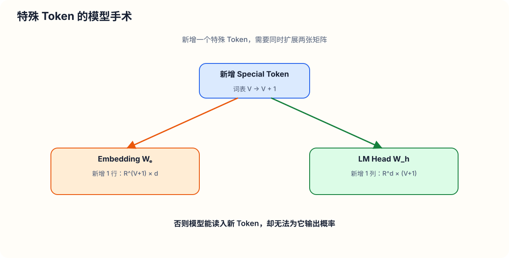
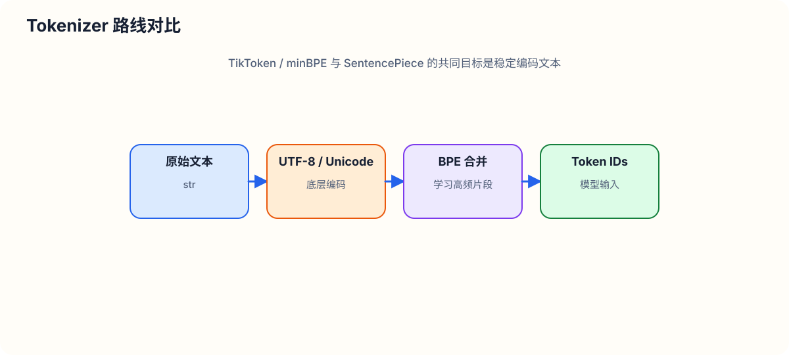
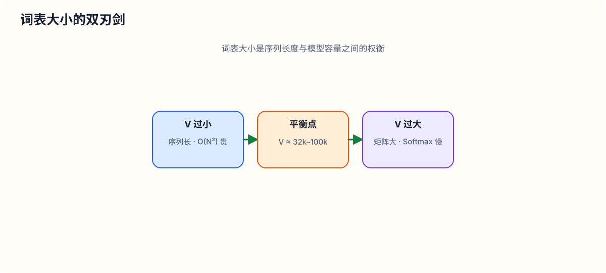
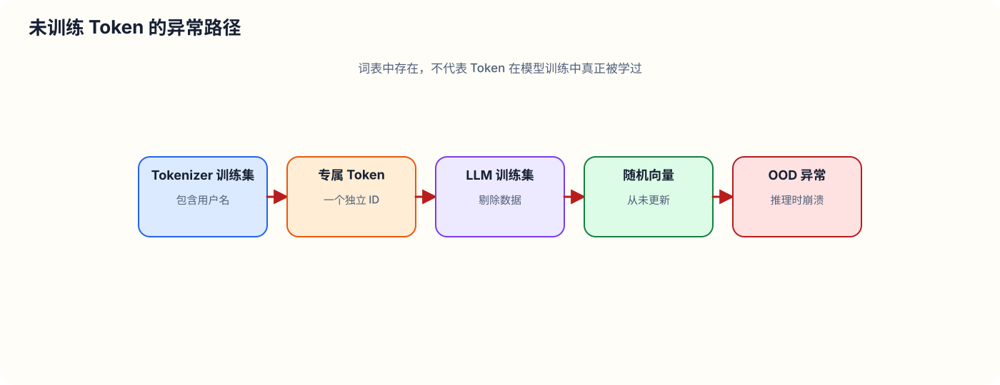

# 深入理解大语言模型中的分词机制（Tokenization & Let's Build GPT Tokenizer）

> **讲师**：Andrej Karpathy  
> **核心主题**：大语言模型（LLM）中的 Tokenization（分词/标记化）机制、Unicode 与 UTF-8 编码、字节对编码（BPE）算法原理与从零代码实现、GPT-2/GPT-4 分词正则规则、Google SentencePiece 对比、特殊 Token 与模型手术，以及分词机制引发的各种 LLM 奇特行为（Footguns & Oddities）。

---

## 1. 导言与分词机制的核心背景

在构建大语言模型（LLM）的过程中，**Tokenization（分词/标记化）** 往往是许多开发者最不喜欢的环节。然而，它又是理解大模型行为所不可或缺的基础。大语言模型中出现的许多奇特现象、看似神经网络架构本身缺陷的问题，本质上都可以追溯到 Tokenization 的处理机制上。

在早期的 *Let's Build GPT from Scratch* 课程中，我们使用了最简单、最直观的**字符级分词器（Character-level Tokenizer）**。当时我们加载了莎士比亚数据集（Shakespeare Dataset），提取了数据集中出现的 65 个不同字符，建立了一个大小为 65 的词表（Vocabulary），并将每一个字符直接映射到一个整数 ID。

例如，输入字符串 `"hi there"` 会被转换为一串整数序列：

```python
# 字符级分词示例
vocab_size = 65
# 假设每个字符对应一个索引 [0, 64]
# "hi there" -> [18, 47, 56, 1, 58, 47, 52, 43, 47]
```

在 Transformer 神经网络中，这些整数 Token 通过一个**词嵌入表（Embedding Table）**转换为可训练的连续向量：

$$
\text{Embedding}: \mathbb{Z}_{|V|} \to \mathbb{R}^d
$$

如果词表大小 $|V| = 65$，嵌入矩阵 $W_e \in \mathbb{R}^{65 \times d}$ 就只有 65 行。每一行对应一个 Token 的 $d$ 维向量表示，随反向传播（Backpropagation）共同训练。

然而，在 SOTA（State-of-the-Art）大语言模型中，人们不再采用简单的字符级切分，而是使用**词块级分词器（Chunk-level Tokenizer）**。词块的构建依赖于诸如 **字节对编码（Byte Pair Encoding, BPE）** 等算法。

在 GPT-2 论文中，作者提出了基于字节级别的 BPE 机制（Byte-level BPE），其词表大小定义为 $|V| = 50,257$，Transformer 的最大上下文长度（Context Length）为 $N_{\text{ctx}} = 1024$。

在 Transformer 的自注意力机制（Self-Attention）中，每一个 Token 都是基本的计算单元（Atom of LLMs）。无论是预训练数据集的规模（如 LLaMA 2 宣称在 2 万亿 Token 上训练），还是模型的推理计算量，都是以 **Token** 为单位进行计量的。

---

## 2. Tokenization 引发的 LLM 奇特现象与痛点

在深入代码实现之前，我们需要充分理解：**为什么 Tokenization 是 LLM 中许多“怪异行为”的罪魁祸首？**

许多看起来像神经网络架构或训练算法的问题，实际上源于分词器对文本的处理方式：

1. **拼写任务（Spelling Tasks）表现差**：LLM 很难 native 地逐字母拼写单词或统计特定字母数量（例如统计 `.defaultstyle` 中有多少个字母 `'l'`）。
2. **简单的字符串操作困难**：例如反转字符串（String Reversal）或提取子串。
3. **非英语语言（Non-English Languages）效率低下**：在非英语文本中，同样的语义需要消耗数倍于英文的 Token 数量，导致序列过长、计算昂贵且上下文窗口被迅速挤爆。
4. **简单算术计算（Simple Arithmetic）不稳定**：数字被切分成长度不一、任意组合的 Token 块，破坏了基于数位的加减法逻辑。
5. **Python 代码缩进处理低效**：在 GPT-2 中，大量连续空格未被合并，导致代码文件的 Token 序列异常膨胀。
6. **末尾空格警告（Trailing Whitespace Issue）**：在 Completion Prompt 末尾多打一个空格会导致模型生成质量急剧下降甚至报错。
7. **特殊 Token 泄露与固态黄金鲤鱼王（SolidGoldMagikarp）现象**：由于分词器训练集与 LLM 训练集不匹配，导致出现“未训练 Token”，使模型产生幻觉、回避甚至谩骂行为。
8. **JSON 与 YAML 的 Token 经济学**：为什么在结构化数据中更推荐使用 YAML 而非 JSON？因为 YAML 的 Token 密度显著高于 JSON。

---

## 3. Tiktokenizer 工具演示与实际切分行为观察

借助于 [tiktokenizer.vercel.app](https://tiktokenizer.vercel.app/) 可视化工具，我们可以实时观察文本在不同分词器（如 GPT-2 的 `r50k_base` 与 GPT-4 的 `cl100k_base`）下的 Token 划分行为。

### 3.1 英文词块与前置空格（Leading Space）
在 GPT 分词器中，单词前的空格通常与单词合并为一个独立的 Token。
- 文本 `"hello world"` 被切分为 2 个 Token：`"hello"` 与 `" world"`（包含前置空格）。
- 文本 `"tokenization"` 被切分为 2 个 Token：`"token"` (30642) 与 `"ization"` (1634)。
- `"egg"` 独立在句首时被切分为 2 个 Token，但在句中 `" an egg"` 时，`" egg"` 却变成了一个单独的 Token。这说明 Token 切分具有**大小写敏感性**与**位置/前缀上下文相关性**。

### 3.2 数字切分的随机性
对于算术表达式 `"127 + 677"`：
- `"127"` 作为一个独立 Token 输入；
- `"677"` 则被拆分为 `"6"` 与 `"77"` 两个 Token。
- 对于四位数字，可能被切分为 `1+3` 位、`2+2` 位或 `3+1` 位，完全取决于词表训练时的统计分布。

### 3.3 非英语语言的序列膨胀
以韩语问候语 `"안녕하세요"` 为例：
- 在 GPT-2/GPT-4 分词器中，这句话被拆分成非常碎小的字节片段。
- 同样语义的一句话，英文可能只需 5 个 Token，而韩语或日语可能需要 15 到 20 个 Token。
- 这意味着非英语文本在 Transformer 注意力机制中的**有效上下文长度缩水到了英文的 $1/3 \sim 1/4$**。

### 3.4 Python 空格缩进的处理
在 GPT-2 中：
- 4 个连续空格被拆分为 4 个独立的 Token（Token ID `220`）。这在缩进密集的 Python 代码中造成了极大的序列浪费。
在 GPT-4（`cl100k_base`）中：
- 4 个空格甚至 7 个空格会被合并为一个 Token，大幅提升了代码文本的压缩比与表达效率。

---

## 4. 字符串、Unicode 代码点与 UTF-8 编码详解

在 Python 中，字符串（`str`）的本质是 **Unicode 代码点（Unicode Code Points）** 的不可变序列。

### 4.1 Unicode 代码点（Code Points）
Unicode 协会（Unicode Consortium）制定的 Unicode 标准（目前为 Unicode 15.1）定义了超过 150,000 个字符（涵盖 161 种书写系统及 Emoji）。

在 Python 中，可以使用 `ord()` 和 `chr()` 函数在字符与其对应的 Unicode 代码点整数之间进行转换：

```python
ord('H')       # 104
ord('😀')      # 128512
ord('안')      # 50505

chr(104)       # 'H'
chr(128512)    # '😀'
```

#### 为什么不能直接将 Unicode 代码点作为 Token ID？
1. **词表体积过大**：直接使用 Unicode 代码点意味着词表大小 $|V| \ge 150,000$，这会导致 Transformer 的 Embedding 矩阵与分类头（LM Head）参数量极其庞大。
2. **标准持续演进**：Unicode 标准仍在不断扩充，缺乏稳定固定的映射。

---

### 4.2 文本编码形式：UTF-8, UTF-16, UTF-32

为了将 Unicode 代码点转换为二进制字节流（Byte Streams），我们需要使用编码（Encodings）。

| 编码方式 | 字节长度 | 特性 | 缺点 |
| :--- | :--- | :--- | :--- |
| **UTF-8** | 1 ~ 4 字节（变长编码） | 完美兼容 ASCII，极高空间利用率，互联网标准 | 变长字节切分相对复杂 |
| **UTF-16** | 2 或 4 字节 | 常见于 Windows/Java 内部表示 | 针对 ASCII 存在大量空字节高位（`0x00`），空间浪费 |
| **UTF-32** | 4 字节（定长编码） | 定长访问方便 | 极度浪费空间（绝大多数字符前 3 字节均为 `0x00`） |

*注：依据 UTF-8 Everywhere 宣言，UTF-8 是当前软件工程与大语言模型数据预处理的最佳选择。*

在 Python 中展示 UTF-8 字节编码：

```python
text = "Hello 😀"
raw_bytes = list(text.encode("utf-8"))
# [72, 101, 108, 108, 111, 32, 240, 159, 152, 128]
```

可以看到，简单的 ASCII 字符 `'H'` 编码为 1 个字节（`72`），而 Emoji `'😀'` 被编码为 4 个字节（`[240, 159, 152, 128]`）。

---

### 4.3 直接使用原始字节（Raw Bytes）的局限

如果直接以 UTF-8 的原始字节作为 Token：
- **基础词表极小**：$|V| = 256$（每个字节范围 `0x00` ~ `0xFF`，即 `0` ~ `255`）。
- **参数开销极小**：Embedding 表只有 256 行。
- **致命缺点**：文本序列长度被大幅拉长。由于 Transformer 自注意力机制的时间与空间复杂度均为序列长度 $N$ 的二次方 $O(N^2)$，过长的字节序列会导致计算资源彻底不可接受。

因此，我们需要借助于 **Byte Pair Encoding (BPE)** 算法，在 256 个基础字节之上，通过迭代合并频繁出现的字节对，建立一个**可调节词表大小**的压缩分词方案。

> **补充：无分词模型（Tokenization-Free Models）**  
> 学术界（如 2023 年夏季的 *MegaByte* 论文）曾尝试通过层次化 Transformer（Hierarchical Transformer）直接在字节流上建立模型，以消除分词器。但由于在大规模工程与计算效率上尚未达到 BPE 的完备性，目前主流 LLM 依然全面依赖基于 BPE 的 Tokenizer。

---

## 5. Byte Pair Encoding (BPE) 算法原理与从零代码实现

### 5.1 BPE 核心算法原理

BPE 是一种简单的自底向上数据压缩算法。其核心步骤如下：
1. **初始化**：以 256 个基本字节（`0` ~ `255`）作为初始词表，输入文本表示为字节 ID 列表。
2. **统计频次**：遍历当前 Token 序列，统计所有相邻 Token 对（Byte Pairs, 即 Bigrams）的出现次数。
3. **选择最高频对**：找到出现频次最高的那一对 Token $(t_i, t_j)$。
4. **铸造新 Token**：为其分配一个新的整数 Token ID（从 `256` 开始递增），并记录合并规则：$(t_i, t_j) \to t_{\text{new}}$。
5. **替换序列**：将序列中所有连续出现的 $(t_i, t_j)$ 替换为 $t_{\text{new}}$。
6. **迭代重复**：重复步骤 2~5，直至达到预设的目标词表大小 $|V|$ 或设定的合并次数 $N_{\text{merges}}$。

#### 玩具示例（Toy Example）
假设初始字符序列为 `AAABDAABAC`，基础词表为 `{A, B, C, D}`：
- 序列长度为 10，词表大小为 4。
- **第 1 轮**：统计发现对 `AA` 出现最频繁（3 次）。造新 Token `Z = AA`。序列变为 `ZABDZBAC`（长度 8，词表 5）。
- **第 2 轮**：统计发现对 `AB` 出现最频繁（2 次）。造新 Token `Y = AB`。序列变为 `ZYDZYAC`（长度 7，词表 6）。
- **第 3 轮**：统计发现对 `ZY` 出现最频繁（2 次）。造新 Token `X = ZY`。序列变为 `XD XAC` $\to$ `XDXAC`（长度 5，词表 7）。

经过 3 轮合并，序列长度从 10 压缩至 5，词表大小扩充至 7。

---

### 5.2 从零实现 BPE 训练器（Training Logic）

下面使用纯 Python 从零实现基于 UTF-8 字节的 BPE 训练逻辑。

#### 1. 统计相邻 Token 对频次 (`get_stats`)

```python
def get_stats(ids):
    """
    统计 Token 列表中所有连续相邻对 (pair) 的出现频次
    """
    counts = {}
    for pair in zip(ids, ids[1:]):
        counts[pair] = counts.get(pair, 0) + 1
    return counts
```

#### 2. 合并指定 Token 对 (`merge`)

```python
def merge(ids, pair, idx):
    """
    在 ids 列表中，将所有连续出现的 pair = (p0, p1) 替换为新的 Token ID: idx
    """
    newids = []
    i = 0
    while i < len(ids):
        # 如果当前位置与 i+1 位置匹配目标 pair，且防止索引越界
        if i < len(ids) - 1 and ids[i] == pair[0] and ids[i+1] == pair[1]:
            newids.append(idx)
            i += 2
        else:
            newids.append(ids[i])
            i += 1
    return newids
```

#### 3. 完整训练循环 (BPE Training Loop)

```python
def train_bpe(text, vocab_size):
    """
    基于给定的文本训练 BPE 分词器
    """
    assert vocab_size >= 256
    num_merges = vocab_size - 256
    
    # 步骤 1：将文本转换为 UTF-8 原始字节 ID 列表
    tokens = list(text.encode("utf-8"))
    
    # 记录合并字典：(p0, p1) -> idx
    merges = {}
    
    for i in range(num_merges):
        stats = get_stats(tokens)
        if not stats:
            break
        # 找到频次最高的 Token 对
        top_pair = max(stats, key=stats.get)
        idx = 256 + i
        
        # 执行替换
        tokens = merge(tokens, top_pair, idx)
        merges[top_pair] = idx
        print(f"Merge {i+1}/{num_merges}: {top_pair} -> {idx} (count: {stats[top_pair]})")
        
    return merges
```

#### 4. 计算压缩比（Compression Ratio）

合并完成后，我们可以计算文本序列的压缩率：

$$
\text{Compression Ratio} = \frac{\text{原始字节数 (len(raw\_bytes))}}{\text{压缩后 Token 数 (len(tokens))}}
$$

例如在约 24,000 字节的文本上，仅执行 20 次合并，压缩比即可达到约 $1.27$。对于 GPT-4 等大型词表（~100k），英文文本的压缩比通常能达到 $3.0 \sim 4.0$ 以上。

---

### 5.3 从零实现解码器 (`decode`)

解码过程将一个整数 Token 列表恢复为原始的 Python 字符串。

我们需要首先根据 `merges` 构造从 Token ID 到对应 `bytes` 对象的映射表 `vocab`：

```python
def build_vocab(merges):
    # 初始 256 个字节映射
    vocab = {idx: bytes([idx]) for idx in range(256)}
    # 按合并顺序构建组合字节
    for (p0, p1), idx in merges.items():
        vocab[idx] = vocab[p0] + vocab[p1]
    return vocab

def decode(ids, merges):
    """
    解码：Token IDs -> Python str
    """
    vocab = build_vocab(merges)
    # 将所有 Token 的 bytes 拼接
    raw_bytes = b"".join(vocab[idx] for idx in ids)
    # UTF-8 解码，使用 errors='replace' 替换无效字节序列（如单独的非法字节）
    text = raw_bytes.decode("utf-8", errors="replace")
    return text
```

> **注意：无效字节序列与 UTF-8 规范错误**  
> 如果传入的 `ids` 包含无法构成完备 UTF-8 字符的孤立字节（如 `[128]`），简单的 `decode("utf-8")` 会抛出 `UnicodeDecodeError`。在实际大模型推理中，必须使用 `errors="replace"`，将其安全替换为官方替换字符 `` (U+FFFD)。

---

### 5.4 从零实现编码器 (`encode`)

编码过程将一个新的字符串转换为 Token ID 列表。必须遵循**优先执行最早训练出来的合并（Lowest Merge Index）** 的规则：

```python
def encode(text, merges):
    """
    编码：Python str -> Token IDs
    """
    # 1. 转换为 UTF-8 原始字节列表
    tokens = list(text.encode("utf-8"))
    
    while len(tokens) >= 2:
        stats = get_stats(tokens)
        # 寻找当前序列中在 merges 中索引最小（最早出现）的 pair
        pair = min(stats.keys(), key=lambda p: merges.get(p, float("inf")))
        
        # 如果最小 pair 不在 merges 中，说明已无可以继续合并的对，退出循环
        if pair not in merges:
            break
            
        idx = merges[pair]
        tokens = merge(tokens, pair, idx)
        
    return tokens
```

---

## 6. GPT 系列模型中的分词器与正则切分规则（Regex Rules）

在实际生产环境中（如 GPT-2、GPT-4），绝不能将整个文本直接送入上述朴素 BPE 算法。

### 6.1 动机：防止无意义的跨界合并

假设文本中包含单词 `"dog"`，它在数据集中频繁跟在标点符号后出现，例如 `"dog."`、`"dog!"`、`"dog?"`。

如果直接运行朴素 BPE，算法很可能会将 `"dog"` 和 `"."` 合并为一个新的独占 Token `"dog."`。这会导致词表中充满带有各种标点后缀的标点-单词混合体，既浪费词表空间，又破坏了语义（语义 `"dog"` 与标点 `"."` 应当解耦）。

因此，GPT 系列引入了基于**正则表达式的预切分（Pre-tokenization / Chunking）**：先将文本粗暴分割为若干片段，**禁止跨越片段边界进行 BPE 合并**。

---

### 6.2 GPT-2 的正则表达式切分规则

在 OpenAI 的 GPT-2 官方源码（`encoder.py`）中，使用了如下正则规则：

```python
import regex as re

gpt2_split_pattern = r"""'s|'t|'re|'ve|'m|'ll|'d| ?\p{L}+| ?\p{N}+| ?[^\s\p{L}\p{N}]+|\s+(?!\S)|\s+"""
gpt2_pat = re.compile(gpt2_split_pattern)
```

#### 正则规则逐项拆解：

| 正则表达式 | 匹配含义 | 说明 |
| :--- | :--- | :--- |
| `'s\|'t\|'re\|'ve\|'m\|'ll\|'d` | 常见英文缩写撇号 | 将 `'s`, `'re` 等强行拆分为独立切分块 |
| ` ?\p{L}+` | 可选的前置空格 + 1个或多个 Unicode 字母 | 将单词连同前置空格划分为一块（如 `" world"`） |
| ` ?\p{N}+` | 可选的前置空格 + 1个或多个 Unicode 数字 | 将数字序列划分为一块 |
| ` ?[^\s\p{L}\p{N}]+` | 可选的前置空格 + 非空白/非字母/非数字字符 | 匹配标点符号组 |
| `\s+(?!\S)` | 空白字符序列（使用负向先行断言） | 匹配连续空白，保留最后一个空白字符供后文词块前缀合并 |
| `\s+` | 兜底空白字符 | 匹配剩余的尾部空格 |

通过 `re.findall(gpt2_pat, text)`，输入字符串被切分为独立的字符串列表（Chunks）。每一个 Chunk 独立执行 BPE 合并，最后将结果直接拼接。这就彻底杜绝了字母、数字、标点符号之间的跨界合并。

#### GPT-2 正则规则的漏洞与历史局限：
1. **缩写规则未指定忽略大小写**：未设置 `re.IGNORECASE`，导致 `"HOUSE'S"` 中的 `'S` 无法匹配硬编码的 `'s`，造成大小写文本分词行为不一致。
2. **硬编码 ASCII 撇号**：只支持普通 ASCII 撇号 `'`，遭遇 Unicode 弯撇号 `’` 时会退化拆分。

---

### 6.3 GPT-4 (`cl100k_base`) 的正则规则改进

OpenAI 在 GPT-4 中重写了正则切分规则：

```python
gpt4_split_pattern = r"""(?i:'s|'t|'re|'ve|'m|'ll|'d)|[^\r\n\p{L}\p{N}]?\p{L}+|\p{N}{1,3}| ?[^\s\p{L}\p{N}]+[\r\n]*|\s*[\r\n]+|\s+(?!\S)|\s+"""
gpt4_pat = re.compile(gpt4_split_pattern)
```

#### GPT-4 的三大关键改进：
1. **支持大小写不敏感匹配 (`(?i:...)`)**：修复了缩写匹配在全大写文本上的缺陷。
2. **限制数字最多合并 3 位 (`\p{N}{1,3}`)**：强行阻止多于 3 位的数字被合并为一个大 Token，大幅改善了大数运算与数字处理的稳定性。
3. **优化换行符与连续空格组合**：对代码中的缩进与换行进行更高效的组块合并，消除了 GPT-2 中单空格 Token 滥用的效率陷阱。

---

### 6.4 OpenAI GPT-2 `encoder.py` 源码架构解析

OpenAI 导出的 GPT-2 分词器包含两个关键权重文件：
1. **`encoder.json`**：对应我们代码中的 `vocab`，即整数 Token ID $\to$ 编码字符串的映射（大小 `50,257`）。
2. **`vocab.bpe`**：对应我们代码中的 `merges`，记载了 50,000 次 BPE 合并的具体顺序。

*注：OpenAI 源码中额外设计了 `byte_encoder` 与 `byte_decoder` 两个辅助映射，将任意字节映射为可打印的 Unicode 字符（例如避免不可见控制字符在 JSON 中转义报错），这仅仅是工程实现细节，并不改变底层 BPE 的数学逻辑。*

---

## 7. 特殊 Token（Special Tokens）与模型手术（Model Surgery）

除了从文本和字节合并得到的常规 Token 外，分词器还需要**特殊 Token（Special Tokens）** 来充当控制信号或边界分隔符。

### 7.1 常见的特殊 Token 种类

1. **`<|endoftext|>`**：
   - GPT-2 中的唯一特殊 Token，Token ID 为 `50256`（词表总长 `50257`）。
   - 在无监督预训练中，插入在不同文档之间，提示 Transformer 上下文已被截断，后续文本与前文无关。
2. **对话控制符（ChatML / Multi-turn Tokens）**：
   - GPT-3.5/GPT-4 引入的特殊 Token，如 `<|im_start|>`（ID `100264`）、`<|im_end|>`（ID `100265`）。
   - 用于区分 `system`、`user` 和 `assistant` 的多轮对话边界。
3. **FIM（Fill-in-the-Middle）代码填空 Token**：
   - 用于代码补全的特殊 Token：`<|fim_prefix|>`, `<|fim_middle|>`, `<|fim_suffix|>`。

特殊 Token **不会通过 BPE 正则与合并算法处理**，而是在分词器的最外层通过硬编码匹配强行拦截并直接替换为指定的 Token ID。

---

### 7.2 模型手术（Model Surgery）

当我们需要向已有预训练模型中引入新的特殊 Token 时，必须同步修改 Transformer 模型的两处矩阵参数：



1. **词嵌入矩阵（Token Embedding Table）**：
   从 $W_e \in \mathbb{R}^{V \times d}$ 扩展为 $W_e' \in \mathbb{R}^{(V+1) \times d}$。新增加的一行（第 $V+1$ 行）通常采用标准差较小的随机正态分布初始化（如 $\mathcal{N}(0, 0.02^2)$）。
2. **输出分类头（LM Head Linear Layer）**：
   最后一层的线性投影矩阵从 $W_h \in \mathbb{R}^{d \times V}$ 扩展为 $W_h' \in \mathbb{R}^{d \times (V+1)}$，以输出新 Token 的 Logits 概率。

在微调阶段（SFT / RLHF），通常可以冻结主干 Transformer 参数，仅微调新增的 Token 向量，或者对整网进行全量微调。

---

## 8. minBPE 库与 GPT-4 分词器重现

为了更彻底地理解与重构分词器，Karpathy 开发并开源了轻量级 Python 库 **`minBPE`**。

### 8.1 minBPE 架构设计

`minBPE` 包含三个核心类：
- `Tokenizer`（基类）：包含基本的训练、编码、解码、 Save/Load 接口。
- `BasicTokenizer`：基于朴素 BPE 算法的简单实现。
- `RegexTokenizer`：实现了 GPT-4 正则分割规则与特殊 Token 处理的高级分词器。

```python
# minBPE 使用示例
from minbpe import RegexTokenizer

tokenizer = RegexTokenizer()
# 在训练文本上训练词表大小为 512 的分词器
tokenizer.train(text, vocab_size=512, verbose=True)

# 编码与解码
ids = tokenizer.encode("Hello World!")
decoded_text = tokenizer.decode(ids)
```

### 8.2 词表合并可视化对比

在泰勒·斯威夫特（Taylor Swift）维基百科页面上训练 `minBPE`，并与 GPT-4 的官方合并规则进行对比：

| 合并顺序 | GPT-4 官方 Merges | minBPE (维基百科训练集) Merges |
| :--- | :--- | :--- |
| **#1 (256)** | `'  '` (双空格) | `'  '` (双空格) |
| **#2 (257)** | `' e'` | `' e'` |
| **#3 (258)** | `' in'` | `' in'` |
| **#4 (259)** | `' er'` | `' a'` |

可以看到，即使训练集不同，高频的英文前缀与空格组合在 BPE 算法下的合并路径具有极高的一致性。差异主要体现在特定领域文本（如代码 vs 维基百科）的空格与词根分布上。

---

## 9. Google SentencePiece 库详解与对比

除了 OpenAI 的 `tiktoken` / `minBPE` 路线外，工业界另一个极其广泛使用的分词库是 Google 维护的 **SentencePiece**（被 LLaMA 1/2、Mistral、Gemini 等众多开源模型采用）。

### 9.1 SentencePiece 与 TikToken 的底层哲学差异



| 维度 | TikToken / minBPE | SentencePiece |
| :--- | :--- | :--- |
| **基础处理层** | 直接将文本转为 **UTF-8 字节流**（0~255） | 直接作用于 **Unicode Code Points** 字符层 |
| **合并起始点** | 从 256 个基本字节开始自底向上合并 | 从训练集包含的所有 Unicode 字符开始合并 |
| **稀有字符处理** | 天然归纳为基础 UTF-8 字节，无需 UNK | 依赖 `character_coverage`，降级为 `unk_token` 或 `byte_fallback` |
| **代码优雅度** | 逻辑极度统一、清晰、无历史包袱 | 包含大量 NLP 传统规范化（Normalization）与历史包袱 |

---

### 9.2 SentencePiece 的关键参数与 Byte Fallback

在 LLaMA 中，SentencePiece 的训练参数配置如下：

```bash
spm_train \
  --input=toy.txt \
  --model_prefix=llama_spm \
  --vocab_size=400 \
  --model_type=bpe \
  --character_coverage=0.9995 \
  --byte_fallback=true \
  --add_dummy_prefix=true \
  --unk_id=0 --bos_id=1 --eos_id=2 --pad_id=-1
```

#### 关键参数深度解析：
1. **`byte_fallback=true`**：
   当遇到训练集中未出现过的稀有 Unicode 字符（如未覆盖的韩文字符 `"안"`）时，如果不开启该项，SentencePiece 会将其直接替换为 `unk_token`（ID 0），丢失全部语义信息！在开启 `byte_fallback` 后，SentencePiece 会将该字符转为 UTF-8 字节，并映射到固定的字节 Token（如 `<0xEC>`），极大提升了泛化能力。
2. **`add_dummy_prefix=true`**：
   在文本开头强制添加一个哑前缀空格 ` `（U+2581），使得句首单词 `"World"` 与句中单词 `" World"` 能够使用完全一致的 Token 表示。
3. **`character_coverage`**：
   控制字符集覆盖率。若设为 `0.9995`，极罕见字符将被排除在基础字符集外，触发 `byte_fallback` 或 `unk`。

---

## 10. 词表大小（Vocab Size）的权衡与前沿扩展

### 10.1 Transformer 架构中词表大小 $V$ 的出现位置

在 PyTorch 代码中，词表大小 $V$（`vocab_size`）仅显式出现在两处：

```python
class GPT(nn.Module):
    def __init__(self, config):
        super().__init__()
        # 1. 词嵌入矩阵: [V, d_model]
        self.token_embedding_table = nn.Embedding(config.vocab_size, config.n_embd)
        
        # ... Transformer Block 层 ...
        
        # 2. 最终输出分类头 LM Head: [d_model, V]
        self.lm_head = nn.Linear(config.n_embd, config.vocab_size, bias=False)
```

---

### 10.2 词表大小 $V$ 的权衡关系

设词表大小为 $V$，模型隐藏层维度为 $d$，上下文长度为 $N$：



---

### 10.3 Prompt 压缩与 Gist Tokens 技术

为了消除长 Prompt 带来的巨大 Attention 计算开销，学术界提出了 **Gist Tokens**（如 *Learning to Compress Prompts with Gist Tokens* 论文）。

其核心思想是在词表中引入少量的虚拟 Token（如 `<gist>`）：
通过蒸馏（Distillation）训练，冻结 Transformer 主干，仅更新新增 `<gist>` Token 的 Embedding 向量。模型学会将前面几百个 Token 的长 Prompt 语义信息“压缩”并沉淀进这几个 `<gist>` Token 的向量中。在推理时，即可抛弃长 Prompt，直接传入对应的 `<gist>` Token，降低计算复杂度。

---

### 10.4 多模态 Tokenization 扩展

在现代多模态大模型中，Token 的思想已从纯文本拓展至所有模态：
- **图像 Token (Visual Patches)**：将图像分割为 $16 \times 16$ 的 Patch，通过 VQ-VAE / ViT 编码为离散的视觉 Token 序列。
- **视频 Token (Sora 架构)**：OpenAI Sora 模型将视频在空间和时间维度上切分为 3D Visual Patches（Spatiotemporal Patches），作为变长 Token 输入 Diffusion Transformer。
- **音频 Token (Audio Tokens)**：使用 SoundStream / EnCodec 等神经网络编解码器将连续音频波形离散化为音频 Token 序列。

---

## 11. LLM 奇特行为的根源深度剖析（Footguns & Oddities）

现在，让我们利用掌握的 Tokenization 知识，深度剖析大语言模型中的各种诡异行为：

### 1) 为什么 LLM 无法拼写单词与反转字符串？

在 GPT-4 的词表中，某些长字符串（例如 `.defaultstyle`）被直接作为一个**独立的单一 Token**：

```python
# GPT-4 分词器行为
enc.encode(".defaultstyle")
# 输出: [100223] (单个 Token ID!)
```

在 Transformer 的自注意力计算中，模型一次性接收到的是 Token ID `100223` 对应的嵌入向量。模型**根本无法感知**这个 Token 内部是由哪些字母组成、首字母是什么、内部有几个 `'l'`。

#### 实验证明：
- 提问：“`.defaultstyle` 中有多少个字母 `'l'`？” $\to$ GPT-4 回答错误（回答 3 个，实际为 4 个）。
- 提问：“请直接反转字符串 `.defaultstyle`。” $\to$ 输出一串乱码废话。
- **破解方法**：在 Prompt 中要求“先用空格将字母打散输出，再反转”。一旦文本被拆分为字母级 Token（`'.' 'd' 'e' 'f' 'a' ...`），模型就能精确看到每一个字符并完成反转！

---

### 2) 为什么非英文文本的表现与效率显著变差？

在分词器训练集（Tokenizer Training Set）中，英文文本占据了绝大多数份额。因此，BPE 算法将大部分合并名额（如 50,000 次合并）都分配给了英文前缀、单词和常用短语。

对于韩文、中文、日文等非英文文本：
- 一个简单的中文短语或韩文问候语，无法匹配到长 Token，会被**打碎成大量的单字甚至单字节 Token**。
- **后果 1**：Token 序列长度增长 $3 \sim 4$ 倍，极其昂贵。
- **后果 2**：Transformer 上下文窗口可容纳的真实语义内容缩减为英文的 $1/3 \sim 1/4$。

---

### 3) 为什么 LLM 算术计算能力极不稳定？

数字在分词器中的切分缺乏一致的数学逻辑。对于四位数字，GPT-2/GPT-3 的切分情况极其混乱：
- `"1234"` 可能被切分为 `"123"` + `"4"`
- `"5678"` 可能被切分为 `"56"` + `"78"`
- `"9012"` 可能被切分为 `"9"` + `"012"`

加法运算算法（如从个位到十位逐位进位）高度依赖数字的**按位对齐**。当数字被随机组合切分成碎片时，Transformer 必须在参数中硬记忆各种任意切分的数字组合加法，导致算术表现极不稳定。这也是为什么 LLaMA 和 GPT-4 强行在正则规则中限制数字切分（如限制最多 3 位数字合并或按单数字切分）。

---

### 4) Python 缩进中的 Token 漏洞

在 GPT-2 中，由于未对代码连续空格合并做特殊优化，每一个缩进空格都是一个独立的 Token ID `220`。一段深度缩进的 Python 代码会产生成百上千个连续的 `220` Token，导致模型的注意力空间被无意义的空格占满，代码补全能力大幅下降。GPT-4 通过修改正则规则合并连续空格，解决了该问题。

---

### 5) 特殊 Token 泄露与 Prompt 截断漏洞

在提示词工程中，如果用户在 Prompt 中恶意嵌入了特殊 Token 字符串（例如 `<|endoftext|>`）：
若分词器在编码用户输入时未屏蔽特殊 Token 逻辑，这个字符串就会被直接编码为 ID `50256`。Transformer 接收到该 Token 后，会误以为上文文档已结束，直接输出空响应或放弃后续任务，造成 **Prompt 注入与服务拒绝漏洞**。

---

### 6) 结尾空格问题（Trailing Whitespace Issue）

在 GPT 模型的 Completion API 中，在 Prompt 末尾敲一个空格（例如 `"Here is a tagline for an ice cream shop "`）会导致官方 API 弹出警告。

#### 原理解析：
在 GPT 的词表中，绝大多数单词 Token 都自带**前置空格**（例如 Token `" shop"`）。
当输入文本以末尾空格结束时，该空格被独立编码为单独的空格 Token ID `220`。在模型训练数据集中，极为罕见出现“独立空格 Token + 下一个 Token”的组合，模型因此陷入 **分布外状态（Out-of-Distribution, OOD）**，引发推理质量急剧下降甚至报错。

---

### 7) 固态黄金鲤鱼王（SolidGoldMagikarp）现象

在 LLM 发展史上，研究人员曾发现一个极其离奇的现象：当要求 GPT-3 重复单词 `"SolidGoldMagikarp"` 时，模型会突然崩溃，表现出拒绝回答、逻辑错乱、幻觉甚至直接用脏话辱骂用户。



#### 根源解释：
- **分词器训练集与 LLM 训练集不一致**：分词器在包含大量 Reddit 帖子的数据集上训练，其中一位高频活跃用户名为 `u/SolidGoldMagikarp`。分词器为其分配了一个专属 Token。
- **未训练的向量（Untrained Memory）**：然而，后续用于训练 LLM 模型参数的数据集剔除了这部分 Reddit 数据。导致在整个 LLM 预训练过程中，该 Token **从未在文本中出现过**。
- 它的 Embedding 向量始终保持着初化时的随机值，相当于 C 语言程序中**未初始化的野指针内存（Unallocated/Untrained Memory）**。在推理时触发该 Token，相当于向 Transformer 中注入了未经训练的随机噪声向量，导致模型产生严重崩溃行为。

---

### 8) JSON 与 YAML 的 Token 经济学

在传输结构化数据时：

```yaml
# YAML 格式 (99 Tokens)
user:
  name: Andrej
  role: Instructor
```

```json
// JSON 格式 (116 Tokens)
{
  "user": {
    "name": "Andrej",
    "role": "Instructor"
  }
}
```

JSON 包含的大量双引号 `"`、花括号 `{}` 和冒号 `:` 被切割为大量零碎的标点 Token。而 YAML 主要依赖换行与缩进，在 GPT-4 的分词正则下能够被高度压缩。**在 Token 计费与上下文窗口敏感的场景下，YAML 显著优于 JSON。**

---

## 12. 总结与实践指南

### 12.1 避坑指南与最佳实践

1. **不要轻视 Tokenization**：在定位 LLM 的拼写、算术、多语言或代码格式化 Bug 时，优先检查分词器的 Token 划分为首要步骤。
2. **文本生成推理**：尽可能避免输入带有末尾尾随空格（Trailing Whitespace）的 Prompt。
3. **推理库选择**：
   - 如果使用现有的 GPT-4 / OpenAI 体系，直接使用官方 `tiktoken` 库（基于 Rust，极其高效）。
   - 如果需要从零训练自己的分词器，建议使用 Google `SentencePiece`，并务必仔细检查参数（必须配置 `byte_fallback=true`，避免硬编码上下文长度过度截断）。
4. **终极展望（Tokenization-Free Future）**：
   任何成功消除 Tokenization、直接在原始字节流（Raw Byte Streams）上实现高效 Transformer 推理的架构设计，都将获得大模型领域的终极荣誉。在这之前，深刻理解并掌握 BPE 分词机制，是每一位 AI / 深度学习工程师的必备功底。
